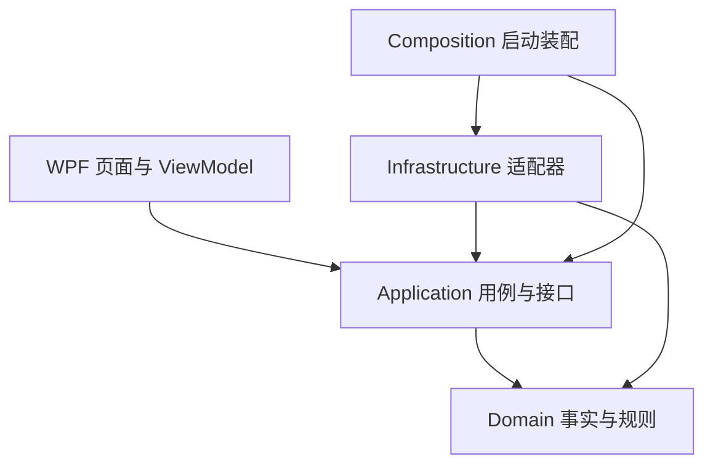

# 项目结构与分层约定

## 当前结构

```text
CRS/
├─ CRS.sln
├─ Directory.Build.props
├─ Directory.Packages.props
├─ config/
├─ src/
│  ├─ CRS.Domain/
│  │  ├─ Trades/
│  │  ├─ FIFO/
│  │  ├─ ExchangeRates/
│  │  └─ TaxRules/
│  ├─ CRS.Application/
│  │  ├─ Abstractions/
│  │  ├─ Imports/
│  │  ├─ TaxCalculation/
│  │  ├─ Reconciliation/
│  │  ├─ Reporting/
│  │  └─ Workflows/
│  ├─ CRS.Infrastructure/
│  │  ├─ Persistence/
│  │  ├─ Brokers/IBKR, FUTU/Pdf
│  │  ├─ ExchangeRateProviders/
│  │  ├─ Exports/
│  │  ├─ Configuration/
│  │  ├─ Security/
│  │  └─ Composition/
│  └─ CRS.Desktop.Wpf/
│     ├─ Views/Pages/
│     ├─ ViewModels/
│     ├─ Controls/
│     ├─ Styles/
│     ├─ Converters/
│     ├─ Services/
│     └─ Composition/
├─ tests/
│  ├─ CRS.Tests.Domain/
│  ├─ CRS.Tests.Application/
│  ├─ CRS.Tests.Infrastructure/
│  ├─ CRS.Tests.Wpf/
│  ├─ CRS.Tests.Verification/
│  ├─ fixtures/
│  └─ Verify-Architecture.ps1
├─ docs/
├─ samples/                         # 本地真实样本，不入 Git
└─ storage/python-legacy/           # 本地资料归档，不参与计算
```

## 依赖方向

Domain 不引用外层或桌面包；Application 只引用 Domain；Infrastructure 实现 Application 的接口并使用领域事实。前台的 Views / ViewModels / Controls 只使用 Application 用例和展示模型。具体 Infrastructure 类型由 Composition 创建，允许前台项目为启动装配引用 Infrastructure。



Application/Abstractions/IDesktopUseCases 是 WPF 前台入口，前台不能获取仓储、解析器或输出适配器。设置窗口通过 IDesktopSettingsService 读写选项；持久化和目录校验由 Infrastructure 执行。IDesktopOperations 留作后台装配端口，不提供给页面。计算、保存、历史读取、复核和导出在后台执行；对话框、导航与取消交互留在前台。

WinForms 项目和 AntdUI 已于 2026-10-10 删除，当前只保留 WPF 前台。数据库默认使用 CRS/data，不自动识别旧版本目录。

年度计算分为 AnnualInputPreparation（账户、报告覆盖与期初成本检查）、CalculationService（计算流程与结果封装）和 AnnualReconciliation（持仓、卖出收益、现金核对）。卖出收益核对按完整证券身份和卖出编号索引 FIFO 匹配批次，避免每笔卖出重复扫描年度底稿。

ReplayExecutionContext 校验历史年度、规则与算法标识，提供历史汇率、配置指纹与临时状态。缺少冻结汇率时拒绝重放，不访问当前配置。CalculationService 可注入 TimeProvider；生产默认系统时钟。此上下文尚不提供执行程序集封存或完整输出一致性证明。

CalculationResult、ImportData、历史索引和规范化快照位于 Application；金额计算规则及交易事实位于 Domain。AppliedRate 仅表达汇率和来源事实；JSON 文件、HTTP 和缓存由 Infrastructure 提供。人工复核说明在 Application 校验，数据库适配器仍保留防御性约束。

## WPF 页面

ShellViewModel 组装页面与 WorkspaceState；WorkspaceState 共享当前冻结结果、汇率指纹、复核依据及忙碌状态。ImportViewModel、ResultsViewModel、DashboardViewModel、HistoryViewModel、ReviewViewModel、ReportsViewModel 和 ExchangeRatesViewModel 分别处理自己的展示与交互。

NavigationView 缓存概览、导入、交易、FIFO、汇率、税务、核对、导出和历史九个页面。概览卡片和任务列表可导航到真实内容。ResultTabs 复用只读底稿，DataGridExtensions 提供列筛选；LiveCharts 显示后台金额并随结果切换更新。尚未接入行情服务。

侧栏支持折叠为图标；SettingsWindow 管理日志与数据库选项。富途收入和交易文件独立替换与清除。金额保持 decimal，展示格式化不重新计算税额。输入改变会同时清除各页面旧结果、图表、人工依据及导出资格；后台运行时共享门槛阻止跨页面重复提交。

## 兼容与验证

SQLite 位置及 user_version=1 保持原有语义。旧 JSON 按属性读取，新字段允许缺失；交易笔数缺失显示“未登记”，真实零笔显示 0。SessionTrades 不参与 JSON 持久化。完整规范化快照遵循用户选项。

各业务命名空间现在为 CRS.Domain / CRS.Application / CRS.Infrastructure。WPF 实现命名空间为 CRS.DesktopClient，避免生成代码中的 Wpf.Ui 名称解析冲突；项目名为 CRS.Desktop.Wpf。

[验证说明](../tests/README.md)记录 Release 构建、架构门槛、分层测试、综合回归及窗口检查。后台规则和存量业务缺口继续按既有整改记录处理。
