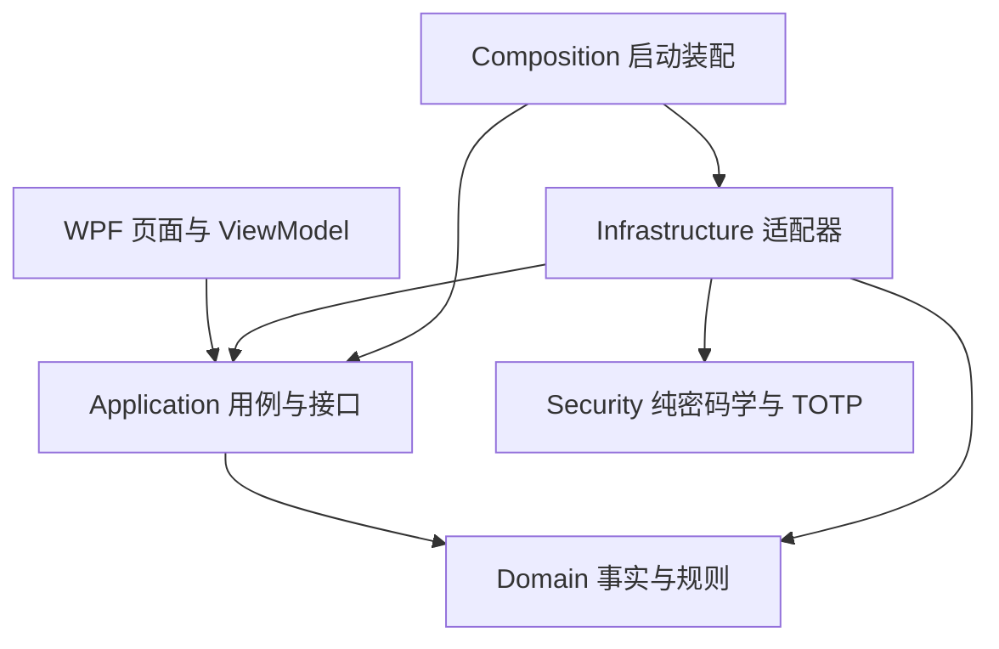
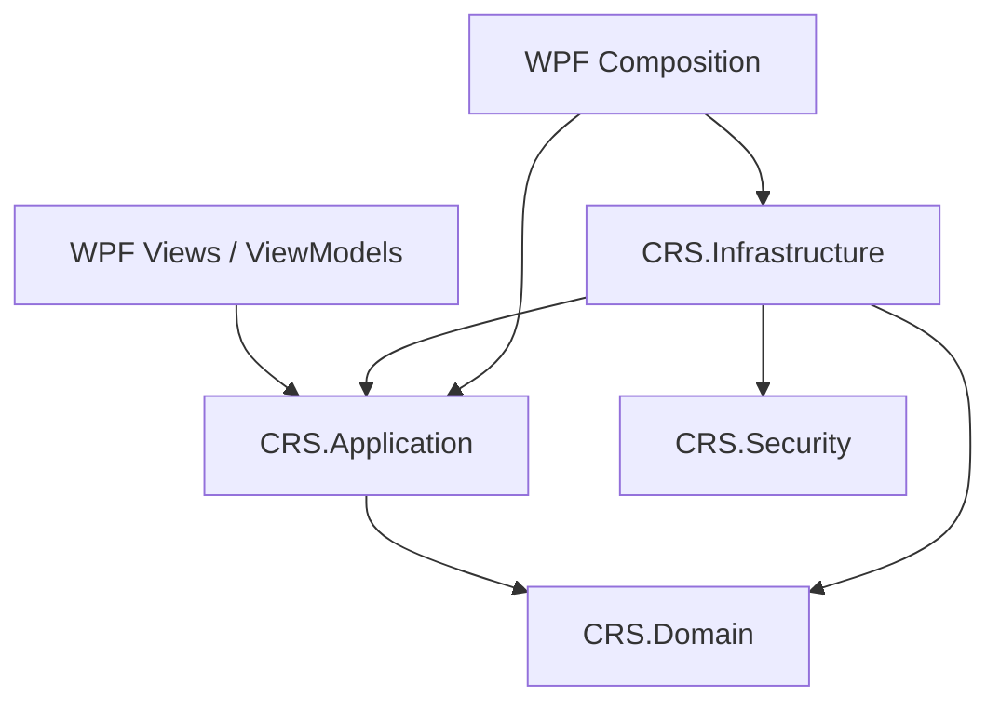

# 项目结构与分层约定

## 当前结构（五个生产项目，含独立 CRS.Security）

```text
CRS/
├─ CRS.sln
├─ Directory.Build.props
├─ Directory.Packages.props
├─ src/
│  ├─ CRS.Domain/
│  │  ├─ Trades/
│  │  ├─ FIFO/
│  │  ├─ ExchangeRates/
│  │  └─ TaxRules/
│  ├─ CRS.Application/
│  │  ├─ Abstractions/
│  │  ├─ Imports/
│  │  ├─ TaxCalculation/
│  │  ├─ Reconciliation/
│  │  ├─ Reporting/
│  │  └─ Workflows/
│  ├─ CRS.Security/                # Cryptography、Vault、Recovery、Authentication
│  ├─ CRS.Infrastructure/
│  │  ├─ Persistence/
│  │  ├─ Brokers/IBKR, FUTU/Pdf
│  │  ├─ ExchangeRateProviders/
│  │  ├─ Exports/
│  │  ├─ Configuration/
│  │  ├─ Security/
│  │  └─ Composition/
│  └─ CRS.Desktop.Wpf/
│     ├─ config/
│     ├─ Views/Pages/
│     ├─ ViewModels/
│     ├─ Controls/
│     ├─ Styles/
│     ├─ Converters/
│     ├─ Services/
│     └─ Composition/
├─ tests/
│  ├─ CRS.Tests.Domain/
│  ├─ CRS.Tests.Application/
│  ├─ CRS.Tests.Security/
│  ├─ CRS.Tests.Infrastructure/
│  ├─ CRS.Tests.Wpf/
│  ├─ CRS.Tests.Verification/
│  ├─ fixtures/
│  └─ Verify-Architecture.ps1
├─ docs/
├─ samples/                         # 本地真实样本，不入 Git
└─ storage/python-legacy/           # 本地资料归档，不参与计算
```

## 当前依赖方向

当前 Domain 不引用外层或桌面包；Application 只引用 Domain；Infrastructure 实现 Application 的接口并使用领域事实，同时引用独立 Security 完成纯密码学与 TOTP 机制。Security 不引用其他生产项目。前台的 Views / ViewModels / Controls 只使用 Application 用例和展示模型。具体 Infrastructure 类型由 Composition 创建。安全实现与边界见 [AUTH_IMPLEMENTATION.md](AUTH_IMPLEMENTATION.md)。



Application/Abstractions/IDesktopUseCases 是 WPF 前台入口，前台不能获取仓储、解析器或输出适配器。设置窗口通过 IDesktopSettingsService 读写选项；持久化和目录校验由 Infrastructure 执行。IDesktopOperations 留作后台装配端口，不提供给页面。计算、保存、历史读取、复核和导出在后台执行；对话框、导航与取消交互留在前台。

WinForms 项目和 AntdUI 已于 2026-10-10 删除，当前只保留 WPF 前台。数据库默认使用 CRS/data，不自动识别旧版本目录。

年度计算分为 AnnualInputPreparation（账户、报告覆盖与期初成本检查）、CalculationService（计算流程与结果封装）和 AnnualReconciliation（持仓、卖出收益、现金核对）。卖出收益核对按完整证券身份和卖出编号索引 FIFO 匹配批次，避免每笔卖出重复扫描年度底稿。

ReplayExecutionContext 校验历史年度、规则与算法标识，提供历史汇率、配置指纹与临时状态。缺少冻结汇率时拒绝重放，不访问当前配置。CalculationService 可注入 TimeProvider；生产默认系统时钟。此上下文尚不提供执行程序集封存或完整输出一致性证明。

CalculationResult、ImportData、历史索引和规范化快照位于 Application；金额计算规则及交易事实位于 Domain。AppliedRate 仅表达汇率和来源事实；JSON 文件、HTTP 和缓存由 Infrastructure 提供。人工复核说明在 Application 校验，数据库适配器仍保留防御性约束。

## WPF 页面

ShellViewModel 组装页面与 WorkspaceState；WorkspaceState 共享当前冻结结果、汇率指纹、复核依据及忙碌状态。ImportViewModel、ResultsViewModel、DashboardViewModel、HistoryViewModel、ReviewViewModel、ReportsViewModel 和 ExchangeRatesViewModel 分别处理自己的展示与交互。

NavigationView 缓存概览、导入、交易、FIFO、汇率、税务、核对、导出和历史九个页面。概览卡片和任务列表可导航到真实内容。ResultTabs 复用只读底稿，DataGridExtensions 提供列筛选；LiveCharts 显示后台金额并随结果切换更新。尚未接入行情服务。

侧栏支持折叠为图标；SettingsWindow 管理日志与数据库选项。富途收入和交易文件独立替换与清除。金额保持 decimal，展示格式化不重新计算税额。输入改变会同时清除各页面旧结果、图表、人工依据及导出资格；后台运行时共享门槛阻止跨页面重复提交。

## 兼容与验证

SQLite 位置及 user_version=1 保持原有语义。旧 JSON 按属性读取，新字段允许缺失；交易笔数缺失显示“未登记”，真实零笔显示 0。SessionTrades 不参与 JSON 持久化。完整规范化快照遵循用户选项。

各业务命名空间现在为 CRS.Domain / CRS.Application / CRS.Infrastructure。WPF 实现命名空间为 CRS.DesktopClient，避免生成代码中的 Wpf.Ui 名称解析冲突；项目名为 CRS.Desktop.Wpf。

[验证说明](../tests/README.md)记录 Release 构建、架构门槛、分层测试、综合回归及窗口检查。后台规则和存量业务缺口继续按既有整改记录处理。

## 安全模块的目标架构（五个生产项目，尚未实现）

**已决定新增 `CRS.Security` 独立类库**。当前四项目源码以及已有的 `Infrastructure/Security/` 目录仍按“当前结构”描述；安全能力尚未落地，不能把本节目标树当作已完成事实。详细规范见 [SECURITY_DESIGN.md](SECURITY_DESIGN.md)，新增离线 MFA 认证详见 [SECURITY_AUTH_SPEC.md](SECURITY_AUTH_SPEC.md)。

```text
CRS/
├─ src/
│  ├─ CRS.Domain/                   # 保持现有 FIFO、税额和交易事实规则
│  ├─ CRS.Application/
│  │  ├─ Abstractions/              # 规划：保险库生命周期、解锁状态、备份/恢复端口
│  │  └─ Workflows/                 # 规划：调用 Application 端口的业务流程
│  ├─ CRS.Security/                 # 【新增独立项目】纯加密与密钥核心
│  │  ├─ Cryptography/
│  │  │  ├─ KeyDerivation/          # Argon2id KDF
│  │  │  ├─ KeyWrapping/            # AES-256-GCM / Key Envelope
│  │  │  └─ Randomness/             # 随机 DEK 和恢复密钥
│  │  ├─ Vault/                     # 密钥封装对象与格式验证，不读写 SQLCipher
│  │  ├─ Recovery/                  # 恢复凭证的密码学操作
│  │  └─ Authentication/            # 【规划】RFC6238 TOTP、二维码URI、随机恢复码纯机制
│  ├─ CRS.Infrastructure/
│  │  ├─ Security/                  # 实现 Application 端口；会话/密钥操作适配、TOTP受限认证及原子防重放
│  │  ├─ Persistence/               # SQLCipher、格式识别、明文拒绝、数据库完整性
│  │  ├─ Backup/                    # 版本化加密备份文件与恢复适配
│  │  └─ Composition/               # 装配 Application / Security / Infrastructure
│  └─ CRS.Desktop.Wpf/
│     ├─ Views/                     # 新建、解锁、恢复、旧库拒绝等视图（规划）
│     ├─ ViewModels/                # 仅调用 Application 用例，不读取 DEK
│     └─ Composition/               # 桌面启动装配
└─ tests/
   ├─ CRS.Tests.Security/          # 【新增】密码派生、密钥封装/恢复、拒绝边界
   ├─ CRS.Tests.Infrastructure/     # SQLCipher/备份/文件识别集成验证
   └─ Verify-Architecture.ps1      # 新增第五项目的引用规则检查
```

**目标项目引用：**

| 项目 | 允许引用的 CRS 项目 | 禁止事项 |
| --- | --- | --- |
| `CRS.Domain` | 无 | 不依赖安全、桌面和持久化程序集 |
| `CRS.Application` | `CRS.Domain` | 不引用 `CRS.Security` / `CRS.Infrastructure` / WPF |
| `CRS.Security` | 无 | 不引用 Domain / Application / Infrastructure / WPF / SQLCipher / Dapper |
| `CRS.Infrastructure` | `CRS.Application`、`CRS.Domain`、`CRS.Security` | 不依赖桌面项目，不将 SQLCipher 实现放进 `CRS.Security` |
| `CRS.Desktop.Wpf` | `CRS.Application`、`CRS.Infrastructure`（启动装配） | Views/ViewModels/Controls 不直接访问 Infrastructure 或 `CRS.Security`；不持有裸 DEK |



**职责边界：** `CRS.Security` 负责可单独测试的密码学机制（Argon2id、密钥生成、AES-GCM 封装、恢复凭证）；`Infrastructure/Security` 只是接口适配与保险库会话编排，SQLCipher、磁盘文件及备份 I/O 留在 Infrastructure。`VaultId` 仅用于保险库身份，不取代按券商/账户/证券/币种隔离的业务身份键。新增 `CRS.Security` 不意味着实现在线账户、订阅或多租户服务。

**认证新增边界：** 首次／恢复由主密码解封 DEK，日常由 Infrastructure 的 DPAPI CurrentUser 本机槽准备受限认证；完成 TOTP 原子消费后才授予业务会话。Application 不引用 Security，WPF 非 Composition 层不接触 SQLCipher 或密钥。保持 10 分钟锁定；独立数据库恢复密钥与一次性手机恢复码用途分开，便携备份不含本机 Windows 槽。

**兼容边界：** 当前使用 SQLCipher，业务 `user_version=1` 与独立认证 `SecurityVersion=1` 分别验证。安全版本**发现明文库即拒绝读取，不做转换或迁移**；只能在用户明确指定的空目录创建或恢复加密保险库，不删除或覆盖旧库与 WAL/SHM。已验证的加密库可补建认证表，但仍须扫码绑定才能访问业务。Application 保持已有的导入、计算、冻结历史、复算与导出门槛。
