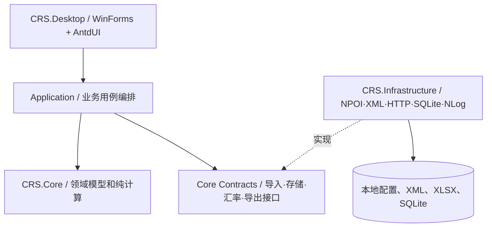
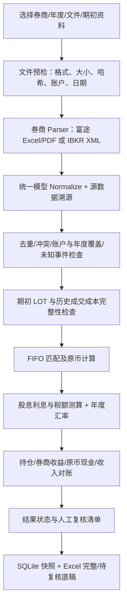

> 历史设计归档：2026-10-10。保留修订前内容；旧技术、示例及验收数字不代表当前实现。当前说明见 [文档索引](../README.md)。

# CRS 境外证券所得税辅助测算系统
## Python → C# .NET 10 WinForms 项目迁移与开发规范（V1.1）

> 文档日期：2026-10-09  
> 文档状态：**V1.1 目标规范 / 已完成当前工作区源码复审及现有验证复跑；P0 缺口、规则签认和完整年度验收未关闭**  
> 目标读者：开发人员、测试人员、技术负责人  
> 主要依据：本次上传的 `PRD.md`、`SAD.md`、`API_SPEC.md`、`CAPITAL_GAIN_FIFO_SPEC.md`、`TAX_ENGINE_SPEC.md`、`FUTU_FIELD_MAPPING.md`、`IBKR_IMPORT_GUIDE.md`、`IBKR_FLEX_AUTO_DOWNLOAD.md`、`EXCHANGE_RATE_SOURCES.md`、`TEST_SPEC.md`、`README.md`。

---

### 当前源码复审更新（2026-10-09）

后续实施更新：开发文档已统一至项目根目录 docs。AR-01 已完成年度聚合服务金额整改，保存原币收入和未限额净税款事实后统一运行年度算法；旧结果缺事实不输出完整预计补税。桌面账户选择与抵免证据门槛仍待完成。下文首次复审结论保留为历史证据，最新工单状态见关联复审文档和整改记录。

富途迁移更新：交易／收入 XLSX、PdfPig 收入 PDF、资产与资金事件、金额核对及桌面入口已实现；SQLite 访问按用户要求使用 Dapper。68 项常规验证及 5 项本地真实模板验证通过；五个年度规范化金额逐行对照 Python，中文 PDF 旧布局仅有合成验收。此更新不关闭通用历史重放／旧结转／税务证据问题，详细支持范围见 [富途 C# 导入与验收](../FUTU_CSHARP_IMPORT_GUIDE.md)。

本次已读取当前 `CRS.Core`、`CRS.Infrastructure`、`CRS.Desktop` 及验证程序，Release 构建为 0 警告、0 错误，现有 36 项合成验证通过。本文后续涉及“本次未收到源码/仅 README 支持”的表述属于原设计评审的历史背景，当前实现状态以本节、[反方架构复审与开发建议](../反方架构复审与开发建议_20261009.md)和[整改记录](../V1.1整改记录.md)为准。正文和附录继续作为目标契约，已有接口不代表完整验收。

复审发现的主要阻断项：年度聚合仍相加账户税额；结转输入重放丢失期初确认；历史汇率缺失会回退当前配置且执行版本未冻结；FIFO 与快照对同秒交易的排序不同；含费总成本升级未提升结转格式版本；抵免证据尚未进入预计补税门槛。详见 AR-01～AR-06。新功能接入顺序调整为：先修金额与状态规则，再修重放/排序/格式兼容，随后接入桌面历史复算和多账户流程，最后扩大富途迁移。

`Replay` 与 `VerifyOriginalFiles` 已有服务接口，桌面历史页面尚无复算入口。规范化快照简单零期初测试通过，不能宣称“任意历史输入按冻结版本可复算”。`AnnualTaxAggregationService` 已有状态继承，但金额规则尚不符合 §4.5。规范 REPLAY-002 与当前测试同名编号含义不同，必须建立映射后再统计验收覆盖。

---

### V1.1 修订记录（2026-10-09）

本版依据对 V1.0 的**反方架构师评审**进行设计层整改，**不是**已修改 C# 源码或验证生产正确性的声明。

| 编号 | 严重度 | V1.1 落地修改 | 验收定位 |
| --- | --- | --- | --- |
| RV-01 | P0 | 将买入 LOT 改为**唯一含费总成本**口径，附费用组成作审计但不重复扣除 | §4.2、§4.4、§8、COST-001～004 |
| RV-02 | P0 | 明确账户隔离、纳税人年度聚合、年度不完整时禁出确定总税额 | §4.5、§9.4、§10.3 |
| RV-03 | P0 | 引入完整性/复核/导出用途的**规则矩阵与判定优先级** | §10.3、附录 D |
| RV-04 | P0 | 建立**输入恢复+规范化快照+不可变运行**的复算闭环 | §11.3、§12.2、附录 E |
| RV-05 | P0 | 新增**券商原始报告、汇总报表、历史 LOT 的优先级和冲突规则** | §5.2、附录 C |
| RV-06 | P0 | 调整依赖顺序：先核心规则/数据契约，再富途迁移、双券商验收 | §15、附录 F |
| RV-07 | P1 | 增加成交时间、跨年归属及去重排序的明确要求 | §4.4、§8.1 |
| RV-08 | P1 | 快照与人工复核分离；新增重算/派生关系 | §12、§10.3 |
| RV-09 | P1 | 增加 WinForms 后台执行/取消/结果提交版本检查 | §10.4 |
| RV-10 | P1 | 补全 DTO、错误分类、自动化断言与准入输出 | §4.3、§16、附录 C-F |

**解释规则**：正文为设计规范；附录 C-F 为同文档中的可实施契约草案。对尚未提交项目负责人确认的税务归属、抵免、去重例外、成本证据等问题，不因写入 V1.1 就自动成为“已批准业务规则”。

---

## 0. 执行摘要

项目原本是面向中国税务居民个人的 **境外证券所得税辅助测算工具**，最早采用 Python + Streamlit，核心能力包括富途年度股息/利息资料、证券交易流水、FIFO 财产转让收益、境外税额抵免辅助计算及 Excel 底稿导出。随后接入 IBKR Activity Flex XML，包括多账户、期初 LOT、已实现盈亏及现金对账。

当前 C# 方案为 `.NET 10 + WinForms + AntdUI + NPOI + NLog + SQLite`，IBKR XML 主流程、含费成本公式、四维结果、取消与历史存储已能构建并通过既有验证。年度聚合、快照复算和旧格式兼容仍有源码可见缺口；富途 C# 业务解析未完成。当前构建和合成测试不构成生产年度验收。

**总体方案：保留现有解决方案；先冻结计算与证据契约（尤其是 IBKR 成本含费、账户/年度汇总、数据完整性准入），通过独立领域测试后再补齐富途入口、开展双券商回归与发布。**

### 0.1 迁移完成的定义（DoD）

1. Windows 桌面应用能独立运行，核心业务不依赖 Python 环境、Streamlit、pandas 或 openpyxl。
2. 富途 Excel 及按已确认样本的 PDF、IBKR Activity Flex XML 均通过统一规范化数据模型进入计算管线。
3. 同一账户与证券的历史成本可追溯；未知成本、公司行动、转仓及未支持交易不会被静默处理成零成本。
4. 对目标年度明确输出**计算状态、数据完整性、对账状态、测算用途**，未完成核验时不提供具有误导性的“完整年度可申报结果”。
5. FIFO、费用、汇率、税额与 Excel 明细由自动化测试验证，关键回归样本经 Python/C# 双实现差异分析。
6. **在用户重新提供同 SHA256 的源文件，或保存可重放的规范化输入快照时**，能够以冻结的导入器、规则、汇率及确认信息复算，同一输入结果摘要一致；仅保存哈希而无法恢复数据的历史记录不声明“可复算”。
7. 费用组成只计入一次；所有已知历史成本必须通过 `CostBasisMode` 区分“含费总成本”与“本金及费用”。
8. 分账户库存、分年度聚合、复核状态和报告用途均经明确判定规则控制；受影响金额不完整时，不生成或展示确定的年度补税总额。

### 0.2 本期范围与边界

| 领域 | 本期目标 | 暂不自动处理 |
| --- | --- | --- |
| 券商 | 富途、IBKR | 其他券商 |
| 数据 | 富途官方格式 Excel/可验证 PDF；IBKR Activity Flex XML | 未经样本确认的 IBKR 普通 CSV/PDF、1042-S 与 Dividend Report 解析 |
| 资产 | 普通多头股票；IBKR 现有范围的多头 ETF | 卖空、期权、期货、窝轮、复杂衍生品及特殊基金分配 |
| 核算 | 分账户 FIFO、股息、收息、境外预扣税、汇率、底稿 | 自动申报、税务结论担保、未经复核的公司行动成本调整 |
| 数据存储 | 本地 SQLite 结果、核对与人工依据；本地配置 | 云同步、账户明文令牌持久化 |
| 环境 | Windows 10/11、.NET 10 WinForms | 浏览器版/跨平台桌面版 |

> **重要区分**：本工具提供中国税务居民境外证券所得的**辅助测算**。旧版 `TAX_ENGINE_SPEC.md` 的 20% 税率、年度均值汇率、亏损及抵免处理是现有*项目测算口径*，不意味着已核验各年度适用法律、具体所得来源地、抵免限额和申报方式。正式使用前应按实际年度及税务事实人工复核。

---

## 1. 来源基线、变更控制与冲突

### 1.1 来源层级

| 来源 | 本文如何使用 |
| --- | --- |
| `README.md` | **现有 C# 版本声明的功能边界、项目目录、依赖、启动与验证命令** |
| `IBKR_IMPORT_GUIDE.md`、`IBKR_FLEX_AUTO_DOWNLOAD.md` | IBKR XML 字段、截止 2026-10-08 的导入、对账与数据完整性实现约定 |
| `EXCHANGE_RATE_SOURCES.md` | 年度汇率来源登记和 2026 年临时汇率元数据 |
| `PRD.md`、`FUTU_FIELD_MAPPING.md` | 富途功能、字段、输入表格、原有输出需求 |
| `CAPITAL_GAIN_FIFO_SPEC.md`、`TAX_ENGINE_SPEC.md`、`API_SPEC.md`、`SAD.md`、`TEST_SPEC.md` | 初版领域模型、公式、接口、分层与测试基线，**须结合后续修订说明使用** |

`API_SPEC.md`、`CAPITAL_GAIN_FIFO_SPEC.md`、`TAX_ENGINE_SPEC.md` 开头均声明：2026-09-22 实施中已经修正账户隔离、年度筛选、缺失成本、规范化导入入口与不完整报告行为，并引用了 **`项目优化建议与IBKR接入规划.md` 第 10 节**。该文件**未随本次资料提供**。因此具体细节仅采纳本次其他已上传文件中明确记载的行为；涉及该未提供文件的精确契约，留为迁移核对项。

### 1.2 必须先修正/确认的旧版矛盾

| 编号 | 旧版内容 | 本次迁移处理 |
| --- | --- | --- |
| GAP-01 | `PRD.md` 6.5 曾建议从“期初持仓总览”的**市价**推导历史成本 | **禁止作为成本依据**；只能使用可证明的真实历史成交、逐批 LOT 或经结构化核验的成本资料 |
| GAP-02 | 初版 FIFO 只按证券代码维护库存 | 改为至少按 **券商、账户、证券身份、币种** 隔离，IBKR 优先 `Conid`，富途须包含市场维度 |
| GAP-03 | 初版部分异常可能终止全量计算，其他章节又允许“缺失成本卖出跳过” | 区分硬错误与**受影响证券/年度不完整**；允许导出待复核底稿，但不能静默跳过并宣称完整 |
| GAP-04 | `CAPITAL_GAIN_FIFO_SPEC.md` 示例三/`TEST_SPEC.md` CASE-003 对跨批次收益要求 **7,494** | 与给定交易数字不符；按 `100×100 + 100×120` 成本、买入费用 `2+1`、卖出费 `3`、收入 `150×150` 核算应为 **6,494**。该值是依原始交易数字推算的**拟修正断言**，须经开发/业务负责人确认后更新测试基线，不得默认保留错误的 7,494 |
| GAP-05 | `PRD.md` 将赠股自动以零成本入账；初版 FIFO 亦把复杂公司行动列为不支持 | **先标记人工复核**；仅在明确规则及原始证据验收后允许特定事件建档，不能自动假设零成本 |
| GAP-06 | 初版 `SAD.md` 写“完全离线，无联网” | C# 应为**本地处理、可选访问 IBKR 官方 Flex 服务**；离线文件导入仍须可用 |
| GAP-07 | `FUTU_FIELD_MAPPING.md` 规定严格的 Excel 字段；`PRD.md` 另列 PDF 与更多表 | 以实际格式样本分别定义解析器；不能仅按旧映射表想象 PDF 布局 |
| GAP-08 | Python 与 C# 年末 LOT JSON 格式不一致 | 设显式 schema/version；开发独立迁移/转换器前禁止混用 |
| GAP-09 | 2026 年临时汇率会显示于报告 | 不能写成 2026 全年已验证汇率，须附截止日、报价数、来源和临时标签 |
| GAP-10 | 初版抵免按年度/币种汇总 | 当前实现**尚未按国家/地区及所得项目逐项核验抵免关系**；作为税额核验缺口明确披露，不自行更改成未经确认的申报规则 |

---

## 2. 技术选型与约束

| 类别 | 目标技术 | 原因/实现要求 |
| --- | --- | --- |
| 语言与运行时 | C# / .NET 10 | 与已在建版本保持一致 |
| UI | WinForms + AntdUI | 本地桌面操作，支持文件选择、验证状态、数据表格与导出 |
| Excel | NPOI | 统一负责富途 XLSX 导入与底稿 XLSX 导出；继承现有读写基础 |
| IBKR XML | `System.Xml` / `XmlReader` 或安全配置的 `XDocument` | 严格校验结构，禁止外部实体/DTD；可追踪源属性 |
| 网络 | `HttpClient` | 仅在用户选择自动下载时访问官方 HTTPS Flex 服务；支持取消和受控重试 |
| 持久化 | SQLite + Dapper | Microsoft.Data.Sqlite 负责连接，Dapper 负责参数化读写和映射；计算快照、人工依据、问题状态、文件摘要与结转元数据 |
| 日志 | NLog | 结构化错误与排障；敏感值脱敏 |
| 配置 | JSON + 强类型 Options | 汇率、来源、Flex Query ID；不存储 IBKR 令牌 |
| 测试 | 保留 `tests/CRS.Tests.Verification`，建议增加 xUnit | 现有验证入口可延用；新模块宜具备自动断言和覆盖率统计 |
| 发布 | `dotnet publish`、Win-x64 | README 当前为 framework-dependent，尚无安装器 |

**第三方依赖注意**：README 记载 NPOI `2.8.1`，存在特定使用情形的维护费/许可条件说明；迁移为企业产品、收费工具或公司部署前，应对**项目实际引用包和使用范围**重新核验许可，不将 README 的说明直接视作法律意见。依赖锁文件 `packages.lock.json`、漏洞扫描及更新策略需沿用。

### 2.1 编码纪律

- 财务金额、数量、费率、汇率统一使用 `decimal`；禁止业务计算中使用 `float` / `double`。
- 金额解析使用明确区域性设置或 InvariantCulture，不受 Windows 系统小数点格式影响。
- 最终人民币金额按原规范保留 2 位并使用 **AwayFromZero**（对应正数 `ROUND_HALF_UP`）；中间保留 8 位精度的具体节点要以对照样本锁定，不在不同服务中随意提前四舍五入。
- 使用 `DateOnly` 表示税年度日期；交易原始时间另以能保持排序的结构表示，**无时区数据不可擅自认为 UTC/北京时间**。
- C# 源码所有手写方法按 README 约定写简明中文用途说明；复杂业务公式注明来源、测试编号。
- UI Designer 管控的控件布局放入 `*.Designer.cs`；不在该文件中写业务；保留 WinForms 设计器所需的无参构造，依赖初始化另用工厂/组合根装配。
- 实施代码应小步迁移，不需要为了“纯净架构”同时引入微服务、消息总线和数据库 ORM 大改造。

---

## 3. C# 目标架构

### 3.1 分层关系



**依赖约束**：UI → Application/Core；Infrastructure → Core 契约；Core **不得**引用 WinForms、NPOI、SQLite、HttpClient。应通过依赖注入/工厂在 Desktop 启动层组装。

### 3.2 当前目录与扩展规则

当前已保留三项目解决方案，按本规范完成物理目录和依赖重整。完整实际树、文件移动表和验证命令见 [项目目录与分层约定](../PROJECT_STRUCTURE.md)。

| 层 | 实际目录 | 当前职责 |
| --- | --- | --- |
| Core | Domain/Models、Domain/Engines、Domain/Rules | 领域记录、含费 FIFO、税额算法与状态规则 |
| Core | Application、Contracts | 年度计算/聚合、快照载体以及导入/汇率/仓储/报告/结转/审计端口 |
| Infrastructure | Brokers/IBKR、Configuration、ExchangeRates | XML、现金核对、官方 Flex 下载和配置读取 |
| Infrastructure | Excel、Persistence、Security、Composition | NPOI、SQLite/结转、安全 XML/文件摘要和应用服务装配 |
| Desktop | Forms、Controls、Composition | 窗口与 Designer 配对、结果表格、启动装配 |
| 测试 | tests/CRS.Tests.Verification、tests/Verify-Architecture.ps1 | 现有合成验收与目录/依赖边界检查 |
| 文档 | 项目根目录 docs | 开发规范、复审、整改及共用设计/券商说明 |

用户已要求开发文档统一到根目录 docs，因此不再保留 CRS.WinForms/docs 的重复副本；README 保留各项目启动入口。Program.cs 保留 Desktop 根目录的启动入口，具体实现仅由 Program/Composition 组装；窗口和控件使用 Core 契约。SDK 自动发现子目录源码，窗体项目显式声明设计器配对关系。

Application 现使用已落地的 CalculationService、AnnualTaxAggregationService，而非示意的未实现 UseCase 类。新增方法和契约均保留中文用途说明；已有领域公共命名空间保持稳定。ResultStatusPolicy 抽取了原有判定逻辑，但业务规则缺口仍按 AR-06/AR-07 跟踪。

后续富途实现进入 Brokers/Futu，按真实样本接入；新增 xUnit 或 Fixtures 时以实际场景为准。ViewModels、独立应用项目和拆分契约文档为扩展建议，不创建空目录或占位类来声明已完成功能。

---

### 3.3 为什么不能直接“Python 文件 → C# 文件”

- Streamlit 页面兼顾输入、状态与展示，而 WinForms 是事件驱动，必须使用用例服务防止计算混入 Button Click。
- pandas DataFrame/Excel Sheet 不是稳定领域模型；计算前需规范化为类型明确的记录及证据链接。
- Python `Decimal` 与 C# `decimal` 在舍入触发点、序列化、小数精度范围等方面可能有差异；只能用数值测试确认一致。
- 原 Python 和 C# 结转格式不同；序列化必须版本化。
- IBKR/Futu 的证券识别与费用结构不同；不要把券商判断散布在 FIFO 代码里。

---

## 4. 统一领域数据模型（推荐最小契约）

### 4.1 基础身份、来源

| 类型 | 关键字段 | 说明 |
| --- | --- | --- |
| `AccountKey` | `Broker`, `AccountId` | 账户隔离。账户名称用于显示，不可独立作为稳定唯一键 |
| `SecurityKey` | `Broker`, `AccountId`, `InstrumentId`, `Market`, `Currency` | IBKR 使用 `Conid` 作为 `InstrumentId`；富途使用经过市场归一化的证券代码/识别键 |
| `SourceRef` | `FileId`, `SHA256`, `Section`, `SourceRow/RecordOrdinal`, `OriginalRecordId` | 数据溯源，Excel 使用行号，XML 使用区段序号；保留源文件类型 |
| `ImportBatch` | `BatchId`, `AccountKeys`, `From`, `To`, `FilePurpose`, `IsPartial`, `Hash` | 一份导出/导入报告的范围与用途 |
| `EvidenceRecord` | `CalculationId`, `IssueId`, `EvidenceType`, `Reference`, `CreatedAt`, `Reviewer` | 人工复核证据，不以文字说明自动修改计算 |

### 4.2 业务对象

| 类型 | 建议字段 | 说明 |
| --- | --- | --- |
| `TradeRecord` | `TradeId`, `AccountKey`, `SecurityKey`, `ExecutedAt`, `Side`, `Quantity`, `Price`, `Gross`, `Fees`, `Currency`, `SourceRef` | 买/卖；`Quantity` 存正值，`Side` 定方向 |
| `FeeBreakdown` | `Commission`, `Platform`, `Levies`, `Taxes`, `Other`, `Total`, `Currency` | 避免富途总费用与明细再相加；IBKR 识别异币费用并进入复核 |
| `DividendIncomeRecord` | `AccountKey`, `Year`, `Dividend`, `Interest`, `OtherIncome`, `Currency`, `SourceRef` | 富途年度汇总可直接入模型；IBKR 来自逐笔现金事件汇总 |
| `CashEvent` | `Type`, `Amount`, `Currency`, `RecordId`, `Date`, `AccountKey`, `SourceRef`, `ReversalOf` | 股息、利息、预扣税及其退回、入出金、未知费用等 |
| `PositionSnapshot` | `AccountKey`, `SecurityKey`, `AsOf`, `Quantity`, `MarkPrice`, `Value`, `LevelOfDetail` | 用于数量/市场价值核对；**MarkPrice 不是历史成本** |
| `OpeningLot` | `LotId`, `SecurityKey`, `OpenedAt`, `RemainingQuantity`, `RemainingTotalCost`, `CostBasisMode`, `FeeDisclosure`, `CostSource`, `SourceRef` | **剩余总成本是唯一扣减量**；`FeeDisclosure` 仅供说明/校验，不得再次扣除 |
| `FifoMatch` | `BuyLotId`, `SellTradeId`, `MatchedQuantity`, `GrossProceeds`, `SellFeeAllocated`, `TotalCostAllocated`, `IncludedBuyFeeDisclosure`, `GainOriginal`, `Currency`, `BuySourceRef`, `SellSourceRef`, `FeeSourceRefs` | `TotalCostAllocated` 已含买入可归属费用，独立审计列不可二次扣减；买卖与费用分别追溯 |
| `TaxSummary` | `TaxpayerScopeId`, `Year`, `CoveredAccounts`, `DividendCny`, `InterestCny`, `ConfirmedCapitalGainCny`, `UnknownGainCount`, `ForeignTaxCny`, `CreditEligibilityState`, `EstimatedTopUpCny?`, `RuleVersion` | `EstimatedTopUpCny=null` 表示不可作确定年度总额；不能把未知金额填 0 |
| `ReviewIssue` | `Code`, `Severity`, `Scope`, `EntityKey`, `Description`, `MissingEvidence`, `Status` | 问题影响对象、性质和修复路径 |
| `CalculationSnapshot` | `CalculationId`, `ParentCalculationId?`, `CanonicalInputDigest`, `InputRecoveryMode`, `Version`, `RateSnapshot`, `Flags`, `Status`, `CreatedAt` | 不可变运行；哈希并不单独构成可重放证据 |

**实现原则**：领域输入对象尽量不可变（`record`/只读属性）；计算过程使用单独 FIFO 内部状态对象并返回不可变的结果。对外报告不直接引用原始 DataTable。

### 4.3 C# 契约示意（建议 API，而非已有实现）

下列定义是**目标契约片段**，未包含全部字段和所有实现，不可直接视作已编译的正式 API。完整字段见附录 C。

```csharp
public enum BrokerType { Futu, Ibkr }
public enum TradeSide { Buy, Sell }
public enum CostBasisMode
{
    PrincipalPlusFees,          // 来源分别给出本金、已归属的费用
    TotalCostIncludesFees,     // IBKR costBasisMoney/经确认的含费总成本
    Unknown                    // 不能用于形成完整资本收益
}
public enum InputRecoveryMode { ReimportOriginalFiles, CanonicalLocalSnapshot, Unavailable }

public sealed record AccountKey(BrokerType Broker, string AccountId);
public sealed record SecurityKey(
    AccountKey Account, string InstrumentId, string Market, string Currency);

public sealed record SourceRef(
    string FileSha256, string Section, int SourceIndex, string? RecordId);

// 财务计算只能扣除 TotalCost 一次；包含于 TotalCost 的买费可供报表展示，不能二次扣除。
public sealed record LotCostBasis(
    decimal TotalCost,
    CostBasisMode Mode,
    decimal? IncludedBuyFeesForDisclosure,
    string CostEvidenceId);

public sealed record OpeningLot(
    string LotId, SecurityKey Security, DateTime? OpenedAt,
    decimal RemainingQuantity, LotCostBasis Cost,
    SourceRef Source);

public sealed record NormalizedTrade(
    SecurityKey Security, string TradeId, string OriginalTradeTime,
    DateTimeOffset? ExecutedAtWithOffset, TradeSide Side,
    decimal Quantity, decimal Price, decimal TotalFees,
    SourceRef Source);

public interface IBrokerImporter
{
    BrokerType Broker { get; }
    Task<ImportResult> ImportAsync(ImportRequest request, CancellationToken ct);
}
public interface IExchangeRateProvider
{
    ExchangeRateSnapshot GetRate(int taxYear, string currency);
}
public interface ICalculationRepository
{
    Task SaveNewRunAsync(CalculationSnapshot snapshot, CancellationToken ct);
    Task<CalculationSnapshot?> FindAsync(string calculationId, CancellationToken ct);
}
public interface IReportExporter
{
    Task ExportAsync(CalculationResult result, Stream output, CancellationToken ct);
}
```

上述 `ImportResult`、`ImportRequest`、`ExchangeRateSnapshot`、`CalculationResult`、`CalculationSnapshot` 需在 `CRS.Core` 有强类型定义；接口细节以实际源码核验和契约签认后定版。交易时间统一由受控 `TradeTimestamp` 服务解释，**原值、时间精度、是否含时区、归属年度依据、稳定排序键**同时保留。

### 4.4 成本与身份不可变约束（RV-01、RV-07）

1. 每个 LOT 只有一个用于 FIFO 的 `RemainingTotalCost`。普通买入形成的 `TotalCost = 买入成交本金 + 已确认、应归属的买入交易费用`；**不得在 Match 中再减同一笔买费**。
2. IBKR `OpenPositions/LOT.costBasisMoney` 是原报告给出的**剩余总成本**，导入采用 `CostBasisMode.TotalCostIncludesFees`；不要在旁边另存一笔可再次扣除的佣金。若费用拆分信息另外存在，只能作为 `IncludedBuyFeesForDisclosure` 或核对信息。
3. 同一来源不同时提供“净额/总额/费用”时，必须有 `CostBasisMode`、原始币种和证据来源；`Unknown` 模式不得参与完整收益。
4. `FifoMatch.GainOriginal = GrossProceeds - SellFeeAllocated - TotalCostAllocated`。`IncludedBuyFeeDisclosure` 在报表展示，但**不参与这一公式**。
5. `TradeId` 必须由券商记录 ID 或已定义的稳定规范化身份产生；`SourceIndex` 仅为追溯和同源排序字段，不能作为跨文件去重的唯一键。
6. 原始时间字符串不可覆盖；交易时间本地/带时区解释策略必须版本化，成交归属年度优先遵循被确认的成交日期口径，不凭交收日期或机器时区改年。
7. 买、卖、买入费用、卖出费用分别保存来源引用；若只存在券商“总费用”，该字段本身为来源，禁止再把其组成加到 TotalFees。

### 4.5 年度聚合责任与所有权（RV-02）

`AnnualTaxAggregationService` 的职责是将**独立券商/账户计算结果**归入同一个 `TaxpayerScopeId + TaxYear`，不参与 FIFO 库存匹配。需要通过用户明确选择和账户所有权确认，把相关账户加入年度测算范围；不同人账户不能因相同姓名或设备而自动合并。

- **先成本匹配，后纳税人年度聚合，再运用本项目已批准的税额规则。** 不得“账户内先算完整税额再直接加总”作为默认业务做法。
- **跨账户收益净额是否按本项目既有规则使用**，须同时标注这是当前辅助测算算法，不作为税法允许净额抵扣的保证；不同所得类别/地区抵免按专项规则管理。
- 逐账户保留：年度成交覆盖率、卖出未知成本数量、未支持事件、币种、已核验现金/税项及期初来源；无法确认时只发布**受影响范围内已确定的明细与待复核结果**。
- 账户 B 的关键成本缺口不能被账户 A 的良好对账状态掩盖；聚合规则采用问题**向上继承**和最保守的完整性标签。
- 仅在 `ResultStatusPolicy` 允许时，`EstimatedTopUpCny` 才是非空。缺失与数值零在数据模型、Excel、UI 中均严格区分。

---

## 5. 统一处理管线



重要边界：仅由 `Application` 统一协调，不允许 Parser 直接调用税务引擎，也不允许 UI 在完成某个文件上传后偷偷更新历史账本。变更券商、年份、文件或确认开关必须使旧结果/旧下载链接失效。

### 5.1 处理阶段与失败策略

| 阶段 | 典型异常 | 处理 |
| --- | --- | --- |
| 文件预检 | 文件损坏、必需 Sheet/Section 缺失、XML DTD、超限 | 阻断此批输入并给出明确信息 |
| 规范化 | 数量/币种/方向冲突；同 ID 内容不一致 | 不能静默修正，按影响范围阻断或列高风险待复核 |
| 成本匹配 | 期初历史成本缺失、卖出超出可信库存、公司行动 | 受影响证券收益**不得作为完整数值**；保留问题与来源 |
| 汇率配置 | 缺年份、币种、来源记录不一致 | 无法生成依赖该汇率的完整人民币结果；可展示原币问题底稿 |
| 年度完整性 | 报告期间有缺口、现金区段缺失、年末 SUMMARY 缺失 | 标为不完整/待复核，允许按规则输出 `Partial_Review` |
| Excel 导出 | 文件被占用、磁盘不足 | 可重试导出，不重新计算且不丢失快照 |

### 5.2 多来源优先级、冲突与幂等（RV-05）

每份输入必须先标记 `FilePurpose`（年度活动成交 / 现金事件 / 期初 LOT / 年末 SUMMARY / 股息年度汇总 / 1042-S 核对凭证 / 结转 JSON 等），再做规范化与去重，**不得把所有金额表直接累加**。具体契约见附录 C：

1. **成交源**：对应年度的逐笔成交是证券收益主数据；同一账户、同一券商原始唯一交易 ID 的完全重复只计一次；ID 相同而数值/级别/币种不一致为冲突，不自动选择“最新文件”。
2. **现金源**：IBKR `CashTransactions/DETAIL` 是本期已经支持的实际入账股息、利息、净预扣税主数据；`CashReport` 是核对依据，不能再次当作收入累加。富途年度股息表为现有富途主数据；其资金进出预扣税需按收入/抵免关系核验。
3. **税务报表凭证**：IBKR 1042-S、Dividend Report（目前未实现解析）与 CashTransactions 重叠时作为核对材料，不自动叠加同一股息或扣税；如需改变主数据优先级，必须签认新策略并保存版本。
4. **成本源**：采用“可信、截止日正确、账户证券身份一致”的单一期初 LOT 或可信完整历史成交重放。LOT+其覆盖期间内同一买入不得双计；年末 `SUMMARY` 只核对数量，不生成成本。
5. **年度汇总报表**：汇总行不能与其构成的逐笔行并列相加；去重不能仅使用“金额+日期+代码”相似度，对未知记录 ID 必须单独定义安全策略。
6. **冲突和缺失**：同 ID 冲突、高风险身份缺失或期初来源重复，阻断受影响计算；只有已确认、不重叠、来源明确的数据才进入聚合。

---

## 6. 富途模块迁移（P0）

### 6.1 输入文件与解析器

按 `PRD.md`，富途有：

1. 股息/利息税表 `.xlsx` 或 `.pdf`，Excel 通常含“账户信息”“股息利息及其他收入”“参考汇率”三个 Sheet；核心内容是**按账户、年份、币种的汇总行**。
2. 交易流水 `.xlsx`，通常含“账户信息”“证券-持仓总览”“证券-资金总览”“证券-交易流水”“证券-资产进出”“证券-资金进出”六个 Sheet。

当前已实现富途年度 XLSX 业务解析与 PdfPig 收入 PDF。Excel 由 NPOI 读取，PDF 通过 PdfPig 字符坐标及表头定位独立解析；NPOI 不负责 PDF。真实三语 PDF 与 Python 对照通过；中文旧表头仅合成验收，扫描件和未知布局保持拒绝。实际限制见 [富途导入指南](../FUTU_CSHARP_IMPORT_GUIDE.md)。

### 6.2 字段映射

交易流水核心 Sheet：

| 富途原列 | 统一字段 | 处理 |
| --- | --- | --- |
| 成交时间 | `ExecutedAt`/原始时间 | 解析秒级时间，保留原行号 |
| 品类 | `AssetCategory` | `证券` 进入支持的计算；`基金` 跳过并显式统计 |
| 代码名称 | `InstrumentId/Symbol` | 附加市场及账户信息，不能只按代码孤立使用 |
| 方向 | `Side` | 买入开仓/买入/BUY → Buy；卖出平仓/卖出/SELL → Sell |
| 数量/面值 | `Quantity` | 校验方向及符号，然后统一存正数量；支持碎股 |
| 价格 | `Price` | `decimal`，必须大于 0 |
| 总费用 | `TotalFees` | 佣金、平台费、交易征费等**已合计**，不能重复加收 |
| 币种 | `Currency` | 标准化为 USD/HKD/CNY 等已支持值 |
| 账户名称/号码、市场、交收日期等 | 对应身份和元数据 | 可用时保留；必要身份缺失要标记而不是跨账户归并 |

股息表：`牛牛号`、`年份`、`账户名称`、`全年股息`、`全年利息`、`全年其他收入`、`币种`。其他收入仅供参考且不参与旧版 V1 的税额计算。参考汇率 Sheet 不参与系统汇率计算。

资金进出：原 PRD 定义按备注 `Withholding Tax`、变动金额、币种识别预扣税；需针对负扣税/退回构造符号测试，且与已汇总税额明确来源关系，防止重复计税。

### 6.3 证券事件

- 证券更名：旧 PRD 根据资产进出中的 `SYMBOL CHANGE`、同日 In/Out 构成历史代码映射；迁移时实现独立 `CorporateActionNormalizer`，**先核对证券身份、事件成对及数量守恒**，再在确定安全的情形维持批次，不覆盖原始交易。
- 拆分、合股、转仓、赠股、成本调整：默认不自动计算其成本影响，列入“受影响证券待复核”；不能因为某行显示 `Gift Stock` 就假定真实计税成本为零。
- 期初/期末持仓：仅做数量/完整性参考；不能用期初市价代替 FIFO 历史成本。

### 6.4 富途验收标准

- 实际样本每个必填列名正确映射，顺序改变仍可导入；额外列不改变结果；缺必填列给出中文具体错误。
- 费项正确计入，不能漏算佣金、平台费、特别行动/交易收费，也不能重复计费。
- 账户、币种和年度独立；跨年度卖出只有存在真实成本批次才计算。
- Excel 行号到 `FifoMatch` 可逐笔回溯；空值、混合文本金额、旧表头及 PDF 差异有回归用例。
- PDF 功能必须用至少一份已脱敏的真实 PDF 样本与对应 Excel/人工表核对；在样本不存在时状态保持**待实现/待验收**。

---

## 7. IBKR 模块保留与增强（P0/P1）

### 7.1 支持输入

- 手动导入 Activity Flex XML，一次可多文件、多账户。当前指南限制每份 XML **25 MB**、一次至多 **36 份活动报告**，沿用并在 UI 预检。
- 自动下载：用户在客户端输入 Query ID、Flex token 与 `fd/td`，使用官方 `SendRequest` 后凭 `ReferenceCode` 调用 `GetStatement`；生成中有限次数重试，支持取消。**token 只在内存保留**，不写 JSON、日志、SQLite、报告。
- 期初资料只接受目标年度上一年 12 月 31 日的 **OpenPositions / LOT** XML，或可验证的 C# 结转 JSON；**SUMMARY 不是 LOT**。
- 如确实期初零持仓，必须人工明确勾选；但勾选不能证明期内无转入资产。

### 7.2 重要 Flex 字段

| Section | 重点属性 | 用途 |
| --- | --- | --- |
| FlexStatement | `accountId`, `fromDate`, `toDate` | 账户及覆盖区间 |
| Trades/Trade EXECUTION | `tradeID`, `assetCategory`, `conid`, `symbol`, `currency`, `buySell`, `quantity`, `tradePrice`, `multiplier`, `dateTime` | 成交与分账户 FIFO |
| Trade 金额 | `proceeds`, `netCash`, `ibCommission`, `ibCommissionCurrency`, `taxes` | 数量×价格、手续费及现金变动核对 |
| Trade 盈亏 | `fifoPnlRealized` | 与本系统逐笔计算盈亏作原币核对，**不是直接代替本系统结果** |
| CashTransaction DETAIL | `transactionID`, `dateTime`, `type`, `currency`, `amount` | 股息、收息、扣税、入出金与其他现金事件 |
| OpenPosition LOT | `openDateTime`, `costBasisMoney`, `position`, `originatingTransactionID` 等 | 真实 FIFO 期初批次成本 |
| OpenPosition SUMMARY | `position`、证券身份、币种、日期 | 年末持仓**数量核对** |
| CashReport Currency | `startingCash`, `endingCash`, `fromDate`, `toDate` | 原币现金闭环；不用 `endingSettledCash` 冒充期末余额 |

若 XML 缺现金明细区段，**不等于全年没有股息**；区段存在且为空才可能表达该覆盖范围内零条现金记录。

### 7.3 规范化及冲突判定

- 只接受 `levelOfDetail=EXECUTION` 的股票/受支持 ETF 成交；Orders、Symbol Summary、Closed Lots 不重复入账。
- 同账户相同 `tradeID` 内容一致时去重；同 ID 关键字段有冲突必须报错。不能仅凭日期、证券代码、数量、价格删除“疑似重复”。
- 现金交易按账户 + `transactionID` 去重；重复 ID 的冲突信息应阻断。
- 同账户 `accountId` 应与 FlexStatement 一致；不支持的 model 分区、证券转入/转出、拆并股、空头及更正保留待复核。
- 交易时间保留原始时区/无时区语义；有时区与无时区记录不能直接混合排序。
- 当前实现仅支持普通多头股票/ETF、乘数 1，佣金同币种和交易税为 0 的情形；异币佣金和非零交易税不偷偷转换为零。

### 7.4 已有对账契约

1. **交易金额**：数量×价格、`proceeds`、`netCash`、佣金/税费之间的关系；超过 **0.02 原币** 进入待复核。
2. **持仓数量**：期初 LOT + 买入 − 卖出 与同年 12 月 31 日 SUMMARY 数量比对；没有可信期初成本不能强行给出肯定结论。
3. **已实现盈亏**：按账户+Conid+币种+卖出 tradeID 汇总本系统 FIFO 与 `fifoPnlRealized`，**差额=本系统−券商**；绝对值≤**0.02 原币**显示一致，超过则逐笔待复核，不允许在年度净额中相互抵消。
4. **现金收入**：CashTransactions/DETAIL 与 CashReport/Currency 的股息、券商利息、预扣税原币合计比较；基础货币汇总不能直接对比原币明细。
5. **原币余额闭环**：`startingCash + 成交及现金明细净变动 = endingCash`；普通换汇进入现金余额闭环，但**不等于已支持外汇证券收益计税**。
6. **年度连续性**：按账户逐个核对年度 Trades、CashTransactions 的区间覆盖、开户日期与数据过滤确认。

`0.02` 是**已有实现的核对容差，不是税法精度规则**。缺字段、无法核对与差异超限应分别显示，不把“0”与“缺失值”混同。

### 7.5 实际样本的现有验收边界

`IBKR_IMPORT_GUIDE.md` 描述了 2026-09-30 三份真实 Flex XML 的**部分验收**：后续补充文件包含成交、35 条现金事件、7 条持仓 SUMMARY，但数据仅覆盖到 2026-09-28，不能代表 2026 全年；另有已识别的期初 LOT 和历史成本缺口、未支持事件。文档记载在诊断场景下的成交与盈亏核对已取得部分一致结果，**不等于年度税额验收合格**。迁移应沿用该界限，并待真实年度完整报告补齐后做端到端验收。

---

## 8. FIFO 核心算法规范（C#）

### 8.1 分组和排序

1. 按 `Broker + AccountId + InstrumentId + Market + Currency` 隔离批次（IBKR 主要基于 Conid；富途以市场+代码及可信更名关系处理）。
2. 在**每个账户证券**中按成交原始时间排序：富途遵循原规范`成交日期/时间 + 原始行号`；IBKR 按原始成交时间、原始 ID/稳定区段序号构建确定性排序。**不同时间语义（带时区/不带时区）不能靠机器本地时区混排**；同秒存在买卖先后可能影响成本且无法可靠确认时，必须标记风险，不可通过字典序假装真实成交顺序。
3. 初始库存来自已核验 LOT 或从可信历史最早交易逐笔重放。不可从收盘价、市值、当期卖出、券商显示的未实现盈亏反推成本。

### 8.2 FIFO 计算规则（统一含费总成本，不得重复扣费）

- 买入（本年新成交）生成独立 LOT。`OriginalTotalCost = 买入数量×买入价 + 已归属买入总费用`；若来源直接给出可信**含费总成本**（如 IBKR 期初 LOT `costBasisMoney`），则直接使用该金额作为唯一成本。
- 将 `RemainingTotalCost` 与 `RemainingQuantity` 配对维护；卖出从 FIFO 队首按数量分摊**整个总成本**，避免将已含费的 `costBasisMoney` 再次扣买费。
- 每条匹配执行以下公式，全部是同一原币口径：

```text
本批匹配数量 q = min(卖出待匹配数量, LOT 当前剩余数量)
分摊总成本 = LOT 当前剩余总成本 × q ÷ LOT 当前剩余数量
分摊卖出费用 = 本次卖出剩余未分配费用 × q ÷ 本次卖出剩余未分配数量
卖出对应收入 = 卖出价 × q
本批原币收益 = 卖出对应收入 − 分摊卖出费用 − 分摊总成本

备注：若来源将买费拆开，先在入库时合成到 LOT 总成本；
     若来源仅提供含费总成本，FeeDisclosure 只供审计，不得再参与扣减。
```

- 使用同一段统一 `AllocationPolicy` 负责精度、非末批分摊和末批尾差。末批采用 `RemainingTotalCost` 与剩余卖出费的原值，确保费用及成本守恒；**不能因格式化显示而丢弃原始精度**。
- 每条 Match 至少保留 `BuySourceRef`、`SellSourceRef`、相关费用源以及 `CostBasisMode`，能够解释该笔收益从何而来。
- 核心不变量：
  1. 完整卖出时 Σ匹配数量=卖出数量；库存不为负。
  2. Σ分摊卖出费用=卖出费用总额；无未知异币费用混入。
  3. 每 LOT 的 Σ已分摊总成本+期末剩余总成本=原始总成本。
  4. 每完整 Match 的 `GrossProceeds - SellFeeAllocated - TotalCostAllocated = GainOriginal`。
  5. 同一费用不得同时计入 `OriginalTotalCost` 和另一笔应扣费字段。
- 当某一批次成本来源不可信、无原币、无成本含费标识或受公司行动影响时，本笔/受影响证券的收益为未知；严禁默认为零成本或保留貌似完整的税额。

### 8.3 典型示例和待修订断言

| 测试 | 输入 | 应验收的结果 |
| --- | --- | --- |
| 完全匹配 | 买 100@100 手续费2；卖 100@150 手续费2 | 收益 4,996；库存 0 |
| 部分匹配 | 买 100@100 手续费2；卖 40@150 手续费2 | 收益 1,997.2；库存60，剩余买费1.2 |
| 跨批次 | 买A 100@100 费2；买B 100@120 费2；卖150@150 费3 | **按这些原始数字推得 6,494**；旧规范及 CASE-003 写 7,494，属待批准修订 |
| 碎股 | 买 0.5、卖 0.3 | 支持非整数，数量不丢精度 |
| 库存不足 | 买100、卖150 | 产生受影响卖出的严重复核问题，不得生成完整收益 |
| 账户隔离 | 账户 A 买入，账户 B 卖出 | 不得用 A 库存弥补 B 卖出 |
| 年度隔离 | 2024 买入，2025 卖出 | 若可信历史成本存在，收益归属 2025 卖出年度 |
| 批次守恒 | 同一 LOT 多次卖出直到售罄 | 已分摊本金费用与期末余额严格守恒 |

**关于 6,494**：本文件没有偷偷改写源文档。此为原交易数字下的算术校核结论，后续必须在 `KnownIssues.md` 登记源规范更正以及 Python 当前实际运行输出，再由负责人明确新的 golden test。

### 8.4 建议代码轮廓

```csharp
public sealed class FifoEngine
{
    /// <summary>按照账户、证券和币种隔离的真实批次完成先进先出匹配。</summary>
    public FifoResult Calculate(
        IReadOnlyList<NormalizedTrade> trades,
        IReadOnlyList<OpeningLot> openingLots)
    {
        // 1. 校验库存来源和交易身份
        // 2. 分组与稳定排序
        // 3. 买入生成 LOT；卖出循环消耗 FIFO 队首
        // 4. 按数量比例分配本金、买费和卖费
        // 5. 校验数量与金额守恒，生成 Match/剩余 LOT/ReviewIssue
        throw new NotImplementedException("迁移实施示意；不可直接用于生产");
    }
}
```

---

## 9. 税额、外币与抵免测算（继承旧口径，并披露风险）

### 9.1 现有计算口径

由 `TAX_ENGINE_SPEC.md` 定义的旧版辅助测算：

```text
股息利息收入人民币 = 各原币收入 × 对应年度配置汇率后汇总
股息利息中国税额 = (股息CNY + 利息CNY) × 20%
可抵免税额 = min(现有口径下境外已缴且可抵免税额, 中国对应税额)
股息利息补税 = max(0, 股息利息中国税额 − 可抵免税额)
年度股票财产转让收益 = 本年度各完整 FIFO Match 的人民币收益汇总
旧版财产转让税额 = max(0, 年度收益) × 20%
预计补税 = 股息利息补税 + 财产转让税额
```

根据旧规则，财产转让亏损不抵减股息利息，不自动跨年度结转亏损。**这是代码口径复刻，并非本文对复杂境外税务抵免/净额申报制度的法律判断。** 当交易成本、抵免归属或年度数据不完整时，结果应标为暂算或待复核，而不是显示可直接申报的确定税额。

### 9.2 汇率配置要求

- `config/exchange_rate.json` 存储按年度/币种的兑换系数；人民币自身固定 1；缺年份/币种不得隐式复用上一年值。
- `exchange_rate_sources.json` 保存来源元数据，原始报价数据另存档；配置值与来源元数据不一致应显示来源无效。
- **2026 年 USD/CNY = 6.852873、HKD/CNY = 0.875157**，是截至 **2026-10-08 的 182 个报价日算术均值**，只用于临时测算；不是全年汇率。2021—2025 年的来源未在本轮核验。
- 汇率来源、查询区间、报价日数、临时/正式标签必须写入计算快照、报告说明、汇率底稿。
- IBKR 报表中的 `FX Rate to Base` 不是税务测算用 CNY 汇率，不能混用。
- `decimal` 保留中间精度，人民币最终两位；锁定“逐笔先换后汇总还是按原币先汇总后换”等舍入节点，必须与选定 golden test 对齐。

### 9.3 抵免规则的明确缺口

现有 IBKR 指南指出，当前扣税按**年度和币种**汇总，尚未根据**所得项目与国家/地区**核对抵免关系。C# 迁移不可把这一缺口隐藏在 `TotalForeignTax` 字段中。至少应保存原币、所得类别、税款性质、来源账户、原始现金事件、可能的对应收入、证据状态，若未能确定税款是否可抵免则生成复核项。后续的国家/地区抵免策略应由独立规则/专业复核确认后再实现，不在本次迁移中凭猜测新增税法逻辑。

### 9.4 年度汇总与确定金额的展示门槛（RV-02）

按本项目现有测算公式，先对属于同一 `TaxpayerScopeId` 的**已完成且成本可信**的 Match 形成原币与人民币收益，再按已批准版本的纳税人年度聚合规则求和；股息、利息和抵免必须独立分类。**“账户税额相加”不是默认实现**，但跨账户净额抵扣是否适用税法必须由专业业务规则签认，不能由程序结构决定。

- 如果任一纳入范围的账户存在影响年度资本收益的**未知成本或漏报期间**，可显示“已核算部分原币/人民币收益”，但年度确定应纳税额和 `EstimatedTopUpCny` 必须为 `null`，不得以“已核算部分收益×20%”冒充全年度值。
- 若境外税收抵免缺乏项目/地区对应关系，则展示“现行项目辅助算法的暂算抵免”及风险，不宣称该值为已审核可抵免额；若关键凭证缺失到影响抵免结论，完整年度**抵免后补税**不得作为确定金额输出。
- 不支持/未定义的证券及所得范围须明确列出；“所有已导入数据都算完”不等于“所有应申报账户、证券和收入完整”。
- 完整计算也只能显示**辅助测算**，绝不自动升级为“可申报/税务机关已认可”。

---

## 10. 计算状态与 WinForms 交互设计

### 10.1 四个独立结果维度

| 维度 | 取值建议 | 依据 |
| --- | --- | --- |
| `CalculationStatus` | `Completed` / `Partial` / `Blocked` | 支持范围内计算是否完成 |
| `DataCompleteness` | `Confirmed` / `Unconfirmed` / `Incomplete` | 年度覆盖、账户范围、期初成本及期末资料 |
| `ReconciliationStatus` | `Matched` / `Differences` / `NotVerifiable` | 券商 PnL、现金、持仓逐项结果 |
| `UsageLabel` | `ReviewReady` / `Provisional` / `ReviewOnly` | 年度完整性、临时汇率与未解决风险 |

**状态不能互相替代**：例如已计算出四笔股票卖出收益，不意味着 2026 全年数据已完整；FIFO 与券商盈亏一致也不意味着抵免依据已正确。

### 10.2 WinForms 页面建议

| 页面/区域 | 内容 | UI 注意点 |
| --- | --- | --- |
| 数据导入 | 券商、税年度、交易/股息/期初 LOT 文件、Flex 自动获取 | 自动获取按钮与本地导入互斥/优先级明确 |
| 预检与确认 | 账户与日期范围、字段检查、缺失区段、是否期初零持仓、无过滤确认 | 不允许默认为用户已确认 |
| 结果总览 | 股息、利息、资本利得、预扣税、补税；四维状态 | 不完整结果突出“仅供待复核” |
| FIFO 明细 | 分账户/证券/年度、买卖批次、费用、原币和人民币收益 | 可点开对应源文件和行号/记录 ID |
| 对账中心 | 已实现盈亏、持仓数量、现金事件、现金余额闭环 | 差异、缺失、未支持分别筛选 |
| 待复核事项 | 成本缺失、转仓、公司行动、汇率来源、范围差异 | 支持证据附件/备注，不以输入备注自动覆盖成本 |
| 历史与结转 | 计算快照列表、配置版本、结转导出/导入 | 不覆盖旧快照，记录结转 schema 版本 |
| 配置与说明 | 汇率来源、IBKR Query ID、隐私声明、规则版本 | token 不持久化 |

**实现方式**：IO 使用 `async`；CPU 密集的 FIFO/工作簿生成必须在受控后台工作线程或明确的任务调度器执行，不能误以为 `async` 声明会自动将计算移出 UI 线程。UI 通过 `CancellationToken`、计算代次号、只读结果快照控制取消和过期结果提交；详情见 §10.4。

### 10.3 结果准入决策矩阵（RV-03，P0）

本表规定**产品呈现与数据完整性保护**，不宣称为法规上的完税标准；只要存在影响完整年度结论的未解决问题，就禁止输出确定的年度最终补税值。

| 事件/条件 | 计算域 | 可导出底稿 | 年度总税额展示 | 结转 LOT | 代表性问题码 |
| --- | --- | --- | --- | --- | --- |
| 全部纳入账户全年覆盖、历史成本可信、汇率非临时且规则已签认、无关键未解项 | `Completed` | 是 | **可显示“辅助测算估计”**，仍非申报批准 | 经核验可 | 无 |
| 卖出缺少历史成本/公司行动影响成本 | 受影响证券 `Partial` | 是，`Partial_Review` | **`null`，只列已知金额与未知范围** | 受影响证券禁止 | `COST_MISSING` |
| 某账户报表缺月、开户区间未确认、必要现金区段缺失 | 受影响账户 `Partial` | 是，`Partial_Review` | **`null`** | 受影响账户禁止 | `PERIOD_GAP` / `CASH_SECTION_MISSING` |
| 2026 年年内/使用已注明的临时平均汇率 | 可算，`Provisional` | 是，临时底稿 | **不得显示“完整年度最终税额”**；暂算金额需明确临时标签 | 不得作为经验证年末结转 | `PROVISIONAL_RATE` |
| 汇率缺失或来源配置自相矛盾 | RMB 计算 `Blocked` | 是，原币待复核 | `null` | 原币可信库存可保留但不能视为税额完整 | `FX_MISSING`/`FX_SOURCE_CONFLICT` |
| IBKR 逐笔收益差异超 0.02 原币 | 成交核对 `Differences` | 是，待复核 | **判断是否影响成本可信性**；影响则 `null` | 差异影响范围不得结转 | `PNL_MISMATCH` |
| 仅缺 `fifoPnlRealized`、其他成本和资料可信 | `NotVerifiable` | 是，标记未核对 | 仅可按批准策略显示辅助测算，**不可宣称全项对账完成** | 按其他证据独立判定 | `BROKER_PNL_MISSING` |
| 收入与境外税额关系/税款可抵免性质无法证明 | Tax credit `Unconfirmed` | 是，待复核 | **抵免后最终补税为 `null`**；可展示未抵免税额等已知分项 | 成本结转独立判断 | `CREDIT_EVIDENCE_MISSING` |
| 同一唯一交易 ID 内容冲突、期初 LOT 来源重复且不可裁决 | 受影响导入 `Blocked` | 诊断清单可导出 | `null` | 不允许 | `DUPLICATE_CONFLICT`/`LOT_OVERLAP` |

**判定优先级**：安全与身份冲突阻断 > 成本/必要年度范围缺失 > 汇率/抵免关键缺失 > 临时数据 > 无法核对的非关键券商字段。各维度分别存储，不允许只使用一个 `IsSuccess` 布尔值。

输出值约定：

- `KnownCapitalGain` 可保存已验证 Match 合计；`UnknownGainCount` 和影响范围单列。
- `AnnualEstimatedTax?` 可空，空为“尚不可确定”，与 0.00 元严格不同。
- 用户“我确认账户范围、无过滤”等是 `UserAssertion` 证据，**不是** `SystemVerified`。
- `ReviewReady` 仅表示可以供人工进一步复核，绝不自动等同 `OfficialTaxReady` 或税务申报结论。
- 若某问题已人工复核，需要结构化依据和新 `CalculationRun`；原历史结果不可就地改成成功。

### 10.4 WinForms 后台任务与结果一致性（RV-09，P1）

- 页面维护单调递增 `InputRevision`；任何券商、年度、文件、成本补录、汇率或确认开关变化，都更新版本并立即使当前结果与导出入口失效。
- 每次计算使用 `RunToken = (InputRevision, UniqueRunId)` 和独立 `CancellationTokenSource`；同一视图默认同一时刻只运行一份计算；后来的计算取消/替代先前请求。
- `HttpClient`/文件 IO 使用真正异步接口。CPU 密集型领域计算/大工作簿构建须明确在线程池或后台执行，不在 UI 线程中长时间同步运行。
- 开始执行前取不可变的 `InputSnapshot`；无论中间 await 如何恢复，**提交结果前**复核当前页面 `InputRevision` 与快照一致，否则丢弃旧执行结果（可保留审计日志，不进入可导出历史）。
- `CancellationToken` 在解析批次、排序前后、FIFO 分组以及导出分段等安全检查点传播；取消过程中不保存半成品 `CalculationRun`。
- 导出前再次核验要导出的 `CalculationId` 与页面展示快照一致；导出异常可重试，但不得为了重试隐式重算和覆盖已有结果。
- UI 线程只能执行控件更新；从后台回 UI 使用 WinForms 支持的线程封送方式，不在领域计算层引用 WinForms。

---

## 11. Excel 底稿与审计追踪

### 11.1 报告结构

兼容 PRD 原要求的“税务汇总、资本利得汇总、资本利得明细、入金汇总”，并保留 IBKR 后续已经增加的审计工作表：

| 工作表 | 关键内容 |
| --- | --- |
| 税务汇总 | 年度、账户/券商范围、人民币税额及使用状态 |
| 股息利息明细 | 账户、币种、股息、利息、其他收入（单独标注未计税）、境外扣税 |
| 资本利得汇总 | 分券商/账户/证券/币种/年度的已完成匹配收益 |
| 资本利得明细 | 买卖日期/ID、LOT、原币收入、**已含买费总成本**、仅供说明的买费组成、卖费、人民币收益、买/卖/费用各自来源 |
| 入金汇总 | 金额、笔数、币种；与应税收入隔离 |
| 现金事件明细 | 现金事件类型、正负号、原币、来源 ID、未支持标记 |
| 期末持仓对账 | 计算库存与 SUMMARY 数量差异 |
| 已实现盈亏对账 | 每笔卖出的券商收益、本系统收益、差额和结论 |
| 现金余额对账 | 期初余额、成交与现金事件变动、期末余额、差异及无法核对原因 |
| 导入来源 | 文件名、SHA256、期间、用途、账户、导入状态 |
| 汇率底稿 | 实际使用的年份/币种/数值/来源/截止日/临时标签 |
| 待复核清单 | 风险编码、描述、影响账户/证券/金额、处理建议、状态 |
| 计算说明与快照 | 规则/导入器/构建版本、运行 ID、父运行 ID、时间、账户范围、规范化输入摘要、来源恢复模式、状态及限制 |

建议文件名：完整候选 `Tax_Report_YYYY.xlsx`；**不完整/仅审阅** `Partial_Review_YYYY.xlsx`（沿用 IBKR 指南习惯）。若存在多个账户，可在封面列示范围，避免同名文件覆盖。

### 11.2 报告不变量

- `TaxSummary` 的金额能够从相应明细按**同一舍入策略**复算出来。
- **不确定收益不以 0 填充**；按受影响标的标注未知/待复核，报告显示已计算金额的适用范围。
- 已实现盈亏的抵销和税额补足与审计底稿拆分，防止“净差为零”遮盖单笔偏差。
- 数据源 SHA256、汇率快照、规则版本保存在 Excel 和 SQLite 中，历史结果不因当前配置变动静默变化。
- 不能因 CSV/PDF/Excel 内容中带公式字符串而执行任意公式；导出用户输入文本优先写成字符串单元格。

### 11.3 可复算闭环与隐私边界（RV-04，P0）

`SHA256` 能验证一份文件是否一致，却不能根据哈希**还原其内容**。`CalculationSnapshot` 必须声明以下三选一的实际能力，不得把只有哈希的记录标为可复算。

| 模式 | 用户隐私与存储行为 | 重算条件 | `IsReplayable` |
| --- | --- | --- | --- |
| `ReimportOriginalFiles`（默认） | 不自动保存敏感原件，仅记录摘要、类型、范围 | 用户重新指定文件，程序逐个验证 SHA256 后重导入；还原所有用户确认与配置版本 | 仅在所需文件可重新提供时为 True |
| `CanonicalLocalSnapshot`（可选） | 经用户选择，受控保存**足以重新计算**的规范化成交/现金/LOT/确认和版本信息，采用本机文件权限；需要时另设计加密与密钥恢复 | 从保存的规范化快照重跑；检查 Digest 与 Schema/Importer/Rules 版本兼容 | 全数据及版本齐备时为 True |
| `Unavailable` | 只有金额/元数据/哈希，源数据已不可获取 | 无法重算，仅能审阅历史导出 | False |

建议在报告“计算说明与快照”打印 `InputRecoveryMode`、`CanonicalInputDigest`、`RuleVersion`、`ImporterVersion`、`RateSnapshotDigest`、`UserAssertionDigest`、`ReplayCapability`。审计验证分两级：

1. **可验证**：源文件哈希/历史规则/报表数字可对照，但不一定能重跑。
2. **可复算**：能从经过校验的原文件重导入或从可用规范化快照重跑，按冻结版本得到同一 `CalculationResultDigest`。

计算输入 Canonical 序列化必须固定 UTF-8、字段顺序、排序键、`decimal` 十进制文本、日期与空值语义及 schema version。不得使用当前 Windows 本地化设置或 JSON 浮点中间值生成摘要。版本不兼容时必须显示“历史快照不可按当前版本复算”，不得静默替换旧规则。

---

## 12. SQLite 数据设计与历史追踪

以下是**建议的逻辑表**，不是对现有 SQLite schema 的描述：

| 表名 | 核心列 | 规则 |
| --- | --- | --- |
| `ImportFile` | `FileId`, `Broker`, `Sha256`, `FileName`, `Purpose`, `DateFrom`, `DateTo`, `ImportedAt` | 原文件追踪元数据；原则上不强制存原始敏感文件 |
| `ImportAccount` | `BatchId`, `AccountKey`, `StatementFrom`, `StatementTo` | 按账户范围去重和完整性核验 |
| `CalculationRun` | `Id`, `ParentRunId`, `TaxpayerScopeId`, `TaxYear`, `RuleVersion`, `AppVersion`, `Status`, `CreatedAt`, `CanonicalInputDigest`, `ResultDigest`, `RecoveryMode` | **已提交运行不可变**，新证据/规则生成子运行 |
| `CalculationRate` | `RunId`, `Year`, `Currency`, `Rate`, `SourceId`, `IsProvisional` | 历史汇率快照 |
| `CalculationSummary` | `RunId`, `Metric`, `Currency`, `Amount` | 避免单个字段不可扩展 |
| `ReviewIssue` | `IssueId`, `RunId`, `ScopeKey`, `Severity`, `Code`, `CreatedStatus`, `Message` | 计算时发现的问题为不可变事实；当前复核状态由独立事件重建 |
| `ReviewEvidence` | `Id`, `IssueId`, `EvidenceType`, `Reference`, `EvidenceDigest`, `EnteredAt`, `EnteredBy` | 证据/附件引用独立于计算；复核结果不回写历史税额 |
| `CarryForwardLot` | `RunId`, `SchemaVersion`, `AccountKey`, `SecurityKey`, `RemainingQty`, `RemainingTotalCost`, `CostBasisMode`, `Source` | 总成本含费、禁重复扣费；仅在成本完整与状态允许时输出 |

数据库迁移采用显式版本号（如 `PRAGMA user_version` 或 `SchemaVersion`）；所有金额建议以适于 `decimal` 无损恢复的 **invariant 字符串**或明确定义的定点整数存储，不未经验证地用 SQLite REAL；序列化往返测试必须覆盖 8 位小数、负数与极小数量。

### 12.2 不可变计算、复核与重算（RV-04、RV-08）

- `CalculationRun`、`CalculationSummary`、`CalculationRate`、冻结的规范化输入及来源身份在完成提交后**只读**；不允许 UPDATE 历史金额、修改原运行汇率或把其不完整标签改成完整。
- `ReviewEvidence`、`ReviewDecisionEvent` 可追加（谁、何时、哪条问题、什么证据、状态及理由），但历史评审事件不得删除/覆盖。`ReviewIssue.CreatedStatus` 记录原始问题发现事实；“当前复核状态”是事件流查询结果。
- 某成本证据被正式采纳后，新运行 `ParentRunId` 指向上次计算，复制并冻结已批准的新输入，对源文件和补录凭证全部重新校验，重算后产生新的 `ResultDigest`；旧报告仍可查看且显示“已由新运行取代”。
- SQLite 新增逻辑表建议：`NormalizedInputSnapshot`（或外部安全快照路径+摘要）、`ReviewDecisionEvent`、`CostEvidence`、`SourceLink`、`RunDependency`；**它们是建议 schema，不代表现有数据库已有**。
- 导入/导出/快照的提交使用事务；失败不得留下声明为成功但缺乏底稿的 `CalculationRun`。更新 schema 前进行备份与迁移回滚验证。
- `ReimportOriginalFiles` 与 `CanonicalLocalSnapshot` 两种模式只能以真实恢复条件声称可复算；旧版历史若无规范化输入/原件，标为 `Unavailable`。

### 12.3 建议数据库关键约束

| 对象 | 约束/索引 | 目的 |
| --- | --- | --- |
| `ImportFile` | UNIQUE(原件 SHA256, 用途, 导入租户/设备域)；文件名不作为唯一键 | 同名不同文件可识别 |
| `ImportRecordIdentity` | UNIQUE(Broker, AccountId, RecordKind, StableRecordId)，冲突内容进入问题表 | 阻止同 ID 双计 |
| `SourceLink` | `RunId + EventId + SourceRole + SourceRef` | 能查到买入、卖出、费用及补录证据 |
| `CalculationRun` | ID 不变；`ParentRunId` 指向历史运行；冻结 `ResultDigest` | 重算不篡改旧结果 |
| `ReviewDecisionEvent` | append-only，自增序号与时间、操作者、依据 | 可重建复核过程 |
| `CarryForwardLot` | `(RunId, LotId)` 唯一，严格版本与含费总成本 | 防止重复结转和重复扣费 |


---

## 13. 安全、隐私与部署

1. **本地处理优先**。手动导入不依赖网络；自动 Flex 下载仅连接官方 HTTPS 服务，不绕过证书校验。
2. **令牌保护**。不在配置、日志、SQLite、报告或异常堆栈保留 Flex token；查询 ID 可保存在配置。不能要求用户通过聊天或代码提交 token。
3. **恶意 XML**。禁止 DTD/外部实体、限制文件大小、元素深度和解析耗时；拒绝结构不完整的文档。
4. **文件隐私**。源文件、税务底稿、日志含账户信息；建议 `%LOCALAPPDATA%/CRS.WinForms` 限定当前用户访问，提供清理历史/敏感日志的功能，禁止将真实账户数据提交到 Git 仓库。
5. **源文件留痕**。以文件名、SHA256、日期和可选保存路径关联原文件，不为便捷复制完整敏感文件到多个临时目录；临时文件安全删除按平台能力设计。
6. **输出审计**。导出时始终包含生成日期和“仅供辅助测算/待复核”说明；不能以“程序运行成功”掩盖未知税务风险。
7. **构建/发布**。沿用 `packages.lock.json`；检查 NuGet 漏洞警示与许可证。发布目标明确是 `win-x64`；在无开发环境机器进行启动、权限与导出测试。若继续使用 framework-dependent 包，需要用户安装 .NET 10 Desktop Runtime；如改 self-contained，应专门验证体积、更新和运行行为。

### 13.1 已上传 README 的常用命令

```powershell
# 项目根目录按实际位置调整
cd CRS.WinForms

dotnet build CRS.sln -c Release

dotnet run --project tests/CRS.Tests.Verification -c Release

dotnet run --project src/CRS.Desktop

dotnet publish src/CRS.Desktop -c Release -r win-x64 --self-contained false -o publish/win-x64
```

上述命令仅为上传 README 记录的项目操作方式，**本次未收到 `.sln`/`.csproj`/源码，未执行构建或测试**。

---

## 14. Python → C# 迁移任务对照表

状态定义：`README 声称已实现` = 文档所述，不等于本次代码验证；`待迁移` = 文档明确未实现；`待核验` = 没有足够源码/样本证据。

| ID | 模块 | Python 来源/旧契约 | C# 对应位置（建议） | 当前证据状态 | 优先级 |
| --- | --- | --- | --- | --- | --- |
| M01 | 桌面入口 | `app.py`/Streamlit | `CRS.Desktop` Forms | README 声称已实现 | P0 核验 |
| M02 | 纯计算 FIFO | `fifo_engine.py`/FIFO SPEC | `CRS.Core/Domain/Engines/FifoEngine` | README 声称已实现（IBKR） | P0 回归 |
| M03 | 税额测算 | `tax_engine.py`/TAX SPEC | `CRS.Core/Domain/Engines/TaxEngine` | README 声称已实现 | P0 回归 |
| M04 | 汇率与来源 | `exchange_rate.json` 等 | `CRS.Infrastructure/ExchangeRates` | README 声称已实现，来源需核验 | P0 |
| M05 | IBKR XML 导入 | IBKR_IMPORT_GUIDE | `CRS.Infrastructure/Brokers/IBKR` | README 声称已实现 | P0 回归 |
| M06 | IBKR Flex 自动下载 | IBKR_FLEX_AUTO_DOWNLOAD | `IbkrFlexClient` | README 声称已实现 | P0 回归 |
| M07 | IBKR 对账 | IBKR_IMPORT_GUIDE 3节 | `Reconciliation` | README 声称已实现 | P0 回归 |
| M08 | Excel 导出 | `ExportService` | `NpoiReportExporter` | README 声称已实现 | P0 回归 |
| M09 | SQLite 历史 | Python 原无统一历史数据库 | `Persistence` | README 声称已实现 | P0 核验 |
| M10 | C# LOT 结转 | 跨年度 LOT | `LotCarryForwardRepository` | README 声称已实现（C#格式） | P0 核验 |
| M11 | 富途交易 Excel 解析 | `FUTU_FIELD_MAPPING.md` | `FutuTradeExcelImporter` | 已迁移，五年度逐行金额对照通过 | **P0** |
| M12 | 富途股息 Excel 解析 | `PRD.md` / 字段映射 | `FutuDividendExcelImporter` | 已迁移，币种与年份边界验证通过 | **P0** |
| M13 | 富途资产/现金事件 | PRD 5.2、6.5、6.7 | `FutuTradeExcelImporter` / `FutuReporting` | 已迁移；未知成本和资产事件保守复核 | P0 |
| M14 | 富途 PDF 股息表 | PRD 5.1 Python pdfplumber | `FutuDividendPdfImporter` / PdfPig | 已迁移；真实三语模板通过，中文旧布局仅合成验收 | P1 |
| M15 | Python/C# LOT 转换 | Python 结转 JSON | `LegacyCarryForwardConverter` | **待迁移**；不得直接互用 | P1 |
| M16 | 结构化期初成本补录与复核复用 | 原项目增强 | `OpeningCostReviewService` | README 明确**尚未完成** | P1 |
| M17 | IBKR 其他税表/CSV | IBKR_IMPORT_GUIDE 0节 | 独立 Importer | 文档明确未实现 | P2 |
| M18 | 国家/地区抵免规则 | TAX SPEC/IBKR 指南限制 | 独立 `TaxCreditPolicy` | 未具备足够业务证据 | P2 业务审查 |
| M19 | 公司行动/转仓成本转换 | 初版不支持 | `CorporateActionEngine` | 尚无成熟规则/验收 | P2 |
| M20 | 端到端真实年度验收 | TEST SPEC/IBKR 真实样本 | `AcceptanceRecords` | 仅部分样本验收 | **P0** |
| M21 | 含费总成本契约与双扣预防 | IBKR LOT `costBasisMoney` | `LotCostBasis`, `FifoEngine` | **V1.1 设计新增，未核实代码** | **P0** |
| M22 | 纳税人年度聚合与所有权范围 | 现有年度汇总规则 | `AnnualTaxAggregationService` | **V1.1 设计新增，未核实代码** | **P0** |
| M23 | 导入源身份/优先级/冲突机制 | 多报表重叠问题 | `SourceSelectionPolicy` | **V1.1 设计新增，未核实代码** | **P0** |
| M24 | 数据完整性与结果准入 | 四维状态/待复核 | `ResultStatusPolicy` | **V1.1 设计新增，未核实代码** | **P0** |
| M25 | 规范化快照复算与版本对照 | 历史与审计 | `CanonicalSnapshotService` | **V1.1 设计新增，未核实代码** | **P0** |
| M26 | 证据/复核事件与派生重算 | 结构化证据补录 | `ReviewDecisionService` | **V1.1 设计新增，未核实代码** | **P0/P1** |
| M27 | WinForms 计算代次与取消 | 桌面业务事件 | `CalculationRunCoordinator` | **V1.1 设计新增，未核实代码** | P1 |

---

## 15. 分阶段实施计划（V1.1 依赖驱动；替代 V1.0 原 Phase 0–5）

**禁止先为了“能出 Excel”绕过成本/完整性防线，再把正确性留到后续修。** 先冻结可测规则，再迁移适配器。每项有产出文件和自动化/人工签认的准入条件；更细执行任务见附录 F。

### 阶段 A：现状盘点与架构/规则基线（P0，先行）

- [ ] A-01 获取并核实 `.sln`、Core/Infrastructure/Desktop、测试、配置、NuGet 锁文件；在 Windows 机器实际执行 README build/verification。
- [ ] A-02 签认 `CostBasisMode` 和 IBKR `costBasisMoney` **含费总成本**；修正重复扣买费设计，添加 LOT 费用守恒用例。
- [ ] A-03 确定 `AccountKey`、`TaxpayerScopeId`、多券商年度聚合策略与抵免事实边界；项目税额算法与税法确认状态分开记录。
- [ ] A-04 签认来源主辅关系、跨文件去重、未知 ID、期初 LOT + 历史成交重叠处理。
- [ ] A-05 建立 `ResultStatusPolicy` 和报告准入矩阵，列出金额非空/未知的全部条件。
- [ ] A-06 明确快照恢复模式、规则版本及摘要格式；纠正旧 FIFO CASE-003 错误断言（从给定样例计算 6,494，待负责人批准）。

**阶段门槛 A（全部达成）**：已有代码状态盘点表；主要 DTO/接口能静态检查/编译；业务冲突清单有决定人和签认结果；每项 P0 问题有测试编号，不能仅写“后续优化”。

### 阶段 B：纯计算、状态与证据闭环（P0，富途正式接入前）

- [ ] B-01 根据 `LotCostBasis` 实现或适配含费总成本 FIFO；覆盖全部/部分/跨 LOT、历史期初 LOT、零值与重复费用。
- [ ] B-02 实现账户与证券库存隔离、纳税人年度聚合入口；年度报告部分缺失时金额可空。
- [ ] B-03 实现 `SourceSelectionPolicy`、冲突报告、稳定排序/成交年度属性；不因多源汇总重复入账。
- [ ] B-04 落地 §10.3 的阻断/临时/仅复核规则，报表与 SQLite 同步展示。
- [ ] B-05 落地至少一种**真实可恢复的输入模式**；完整快照可重跑且 `ResultDigest` 一致；测试历史只读、证据新增及派生重算。
- [ ] B-06 在现有 `CRS.Verification` + 推荐独立单测框架运行关键领域不变量与数据库往返测试。

**阶段门槛 B**：所有 P0 领域自动断言通过；用合成数据可完成“正常完整 / 历史成本缺失 / 多账户混源 / 可复算重放”的全链路；任何计算失败不会提交可下载的确定年度税额。

### 阶段 C：富途 Excel 迁移与 IBKR 双券商回归（P0）

- [x] C-01 富途交易、股息 Excel 导入，逐 Sheet 严格字段校验及来源行号追溯；佣金/平台费/总费用不重收。对应 FUTU-001～011。
- [x] C-02 富途资金进出、预扣税、证券资产事件、期初/期末数量导入；缺真实成本或复杂事件时状态正确。对应 FUTU-007～009、014～020；资产事件保持原版保守处理，安全自动更名仍未开放。
- [ ] C-03 回归 IBKR Flex XML / 官方下载 / 多份报告 / LOT / 逐笔已实现盈亏 / CashReport 闭环。
- [ ] C-04 建立富途与 IBKR 一致的统一规范化中间表，跑 Python/C# 差异定位与独立人工算式。
- [ ] C-05 完成 Excel 导出中买卖/费用来源、含费总成本、所得与抵免分项、问题与快照说明。

本批已回归全部既有 45 项，C-04 已完成五年度规范化逐行金额对照及合成 FIFO 独立算式；真实年度完整 LOT→税额→状态及全部抵免证据仍归 D-02/AR-06 验收，不因本次解析迁移关闭。

**阶段门槛 C**：富途 XLSX 和 IBKR XML 的可用合成样本均可端到端；无双扣买费、无重复股息、无跨账户 FIFO、无遗漏资料却假称全年的路径；真实样本只声明实际覆盖范围。

### 阶段 D：真实年度验收与桌面发布（P0/P1）

- [ ] D-01 准备至少一套经授权、脱敏且年度完整的业务样本；缺失时只记录局部验收，不签全年通过。
- [ ] D-02 Python/C# 对比**规范化数据→LOT→Match→人民币→税额→状态**；差异必须解释并由负责人签认。
- [ ] D-03 WinForms 后台运行、重复点击、取消、切换年度、旧结果失效、导出版本核对和异常恢复。
- [ ] D-04 SQLite schema 迁移、旧运行保持只读、资料恢复与隐私清理；发布机器安装/运行/日志脱敏/依赖许可核对。
- [ ] D-05 形成真实范围和限制的验收记录、发布审批与回滚方案。

**阶段门槛 D**：满足全部必需真实测试、P0 Issue 无未解释遗留、报告明确辅助测算限制；不能因为 C# build 成功便签署业务正确性。

### 阶段 E：受控功能扩展（不阻塞 A–D 的正确性前提）

- [ ] E-01 富途 PDF：获取真实布局样本且与已确认 Excel/人工底稿比对后开放。
- [ ] E-02 Python→C# 结转 JSON 转换器：源 schema、校验和、账户证券身份经测试后才放开。
- [ ] E-03 IBKR 普通 CSV/税表/1042-S 解析、复杂公司行动和来源国抵免策略：必须另立有业务证据的规则版本。

**阶段门槛 E**：任何新增适配器都不能改变既有 golden 输出，除非形成明确的行为变更决策与回归基线升级。

---

## 16. 测试策略与用例矩阵

### 16.1 测试分层

- **Domain Unit**：FIFO、手续费分摊、舍入、年度筛选、税额、汇率、状态判定；不依赖外部文件。
- **Importer Unit**：富途 XLSX/可验证 PDF、IBKR XML、空值/缺列/异常类型/同 ID 冲突、来源行号。
- **Integration**：导入 → 规范化 → 成本计算 → 对账 → SQLite → XLSX，全流程使用合成数据。
- **Golden/Parity**：同一批合法真实脱敏样本，对 Python 与 C# 产出的*规范化中间表、Match、税额明细、状态*分别比较，而不只比较总补税。
- **UAT**：用户操作路径、Windows 兼容、异常提示、同文件重复导入、配置变更导致旧结果失效。

### 16.2 必测清单（建议 CI 按编号执行）

| ID | 场景 | 验收断言 |
| --- | --- | --- |
| FIFO-001 | 完全匹配 | 收益 4996、库存0 |
| FIFO-002 | 部分匹配 | 收益1997.2、剩余60及费用1.2 |
| FIFO-003 | 跨批次 | 用第1章确认后的值，当前建议 **6494**；不能继续照抄 7494 |
| FIFO-004 | 碎股 | 数量与手续费分摊守恒 |
| FIFO-005 | 卖出超库存 | 受影响收益未知，阻止完整税额 |
| FIFO-006 | 同日/同秒 | 同输入每次同结果，排序确定性 |
| FIFO-007 | 多账户同证券 | 库存绝不混用 |
| FIFO-008 | 证券更名/转仓 | 无法证明真实成本时生成复核项 |
| FIFO-009 | LOT + 历史重复来源 | 阻断成本重复计入 |
| TAX-101～107 | 原 `TEST_SPEC.md` 的股息、利息、预扣税、资本盈利/亏损 | 在明确现行旧版规则下回归；缺口另标注 |
| FX-201～203 | USD/HKD、人民币 2 位、Half-up | 无浮点误差，100.005 → 100.01 |
| FX-204 | 2026 临时数据 | 汇率数值与截止日期/来源一并输出 |
| FX-205 | 来源元数据不一致 | 显示无有效来源，不沿用错误说明 |
| FUTU-001 | 完整合法 XLSX | Sheet/字段/来源号正确 |
| FUTU-002 | 缺列或非法方向 | 明确报错/需复核，无静默字段猜测 |
| FUTU-003 | 手续费与税费 | 平台费及征费不漏不重 |
| FUTU-004 | PDF 对照 | 经真实样本验收；无样本保持未验收 |
| IBKR-001 | 多文件/重叠 tradeID | 完全重复去重，冲突 ID 阻断 |
| IBKR-002 | 缺 CashTransactions Section | 不认定零收入，标记不完整/待补数据 |
| IBKR-003 | `SUMMARY` 误作期初 `LOT` | 拒绝作为成本来源 |
| IBKR-004 | 券商逐笔 PnL 差异 | 0.02 原币内一致；超限逐笔待复核 |
| IBKR-005 | `fifoPnlRealized` 为空 vs 为0 | 空是缺失，0 是有效值 |
| IBKR-006 | CashReport 原币余额 | 成交、换汇及现金事件闭环 |
| IBKR-007 | 仅有应计股息 | 不将应计直接作已到账股息 |
| IBKR-008 | Flex 异常/非法 XML | 禁止 DTD、处理网络失败/取消 |
| REPORT-001 | 完整报告 | 表/字段/数值/来源齐全 |
| REPORT-002 | 不完整报告 | 使用 `Partial_Review` 和四维状态 |
| REPORT-003 | SQLite 保存后重开 | `decimal`、规则/汇率/哈希无损还原 |
| REPORT-004 | Python/C# 结转不兼容 | 旧格式必须拒绝或走明确转换器 |
| SEC-001 | IBKR token | 日志、配置、数据库、报表中均不可检索到令牌 |
| SEC-002 | 攻击型 XML/Excel | 无外部实体加载、无不受控资源消耗、导出不执行输入公式 |
| COST-001 | IBKR `costBasisMoney=1002`（本金1000、已含费2）全部卖出 | 只扣1002一次；即便披露手续费2也不得再扣2 |
| COST-002 | 普通买入本金1000+费2 与期初含费1002 的等价输入 | 同一数量和卖价得到同一原币收益 |
| COST-003 | LOT 分两笔卖出，最后一笔吸收尾差 | Σ匹配总成本+剩余成本=原 LOT 含费总成本 |
| COST-004 | LOT 源已含费同时误填另一个买费字段 | 报错或识别为审计披露，不得双扣 |
| AGG-001 | 两账户分别有正/负收益 | 同一纳税人按**签认的年度聚合规则**先合并再计算，保留账户明细；不默认为税法可跨来源抵扣 |
| AGG-002 | A 账户完整、B 账户成本未知 | `AnnualEstimatedTax=null`，同时保留 A 已确认明细 |
| AGG-003 | 不同纳税人作用域/账户 | 严格禁止交叉聚合 |
| SRC-001 | 同一 IBKR tradeID 重叠 XML，完全相同 | 只计算一次，且两份来源均可审计 |
| SRC-002 | 同 ID 金额不同，或期初 LOT 与历史买入双源 | 阻断受影响部分，不能静默选新或选旧 |
| SRC-003 | CashReport/1042-S 与 CashTransactions 同一股息 | 汇总仅出现一次，核对凭证单列 |
| SRC-004 | 富途年度股息汇总与同账户更细收入表 | 同一期间不双计，未知关系时阻断该收入结论 |
| STATUS-001 | 缺历史成本/缺月/收入段缺失 | 能出 `Partial_Review`，确定年度税额字段为 `null` |
| STATUS-002 | 仅券商已实现盈亏字段缺失 | 已算明细保留，`ReconciliationStatus=NotVerifiable`，不冒充全部核对 |
| STATUS-003 | 临时汇率/当前年度 | 仅临时标签，不能给出完整年度最终金额 |
| STATUS-004 | 税额抵免关键依据未确认 | 可以展示已知预扣税，但确定的抵免后总补税为 `null` |
| REPLAY-001 | 用户重传同 SHA256 源件及冻结规则/配置 | 规范化 Digest、ResultDigest 与原运行相同 |
| REPLAY-002 | 只有 SHA256、原件无法取得且无规范化快照 | `IsReplayable=false`，不能显示可复算 |
| REPLAY-003 | 人工复核改变期初成本 | 生成新 Run+ParentRunId，旧金额/状态原封不动 |
| REPLAY-004 | SQLite `decimal`、含费 LOT 往返与 schema 升级 | 数值和来源无损，升级失败可回滚 |
| UI-001 | 后台计算中切换券商/税年度，旧 Run 较晚完成 | 旧计算结果不能覆盖当前页面或下载入口 |
| UI-002 | 取消耗时运算/重试 Excel 导出 | 不留半成功运行，导出不隐式重算 |
| TIME-001 | 同秒买卖/无时区与有时区来源 | 语义明确则稳定且正确；不明确时生成复核风险，不凭机器时区决定 |
| CARRY-001 | 不确定历史成本/不可验证结转 | 禁止将受影响证券生成“可信年末 LOT” |

### 16.3 质量门槛

沿用 `TEST_SPEC.md` 初版目标：Domain ≥95%、Parser ≥90%、Application ≥80%、整体 ≥90%（需要在实际测试框架中配置和统计）。旧版性能基线：10,000 笔交易内计算 ≤5 秒、内存 ≤500 MB；需明确是否**不含文件解析/Excel 导出和网络等待**，以统一机器与真实基准样本验证。若无法满足，应记录可复现的环境与瓶颈，而不是改动财务逻辑来“优化”速度。

**额外准入**：测试覆盖率不替代财务正确性；`COST-*`、`AGG-*`、`SRC-*`、`STATUS-*`、`REPLAY-*` 关键断言**必须 100% 通过**。任何已知重大差异、未经审批的规则变更、真实年度未覆盖全部账户时，不能签署“全年测算验证完成”。维护 `GoldenApprovalRecord`：测试编号、输入哈希、预期数值、来源公式/凭证、版本、批准者与日期。

### 16.4 双实现差异定位

```text
Python / C# 相同输入
   ├─ 原始文件 SHA256 / 账户/日期区间是否一致？
   ├─ 规范化交易/现金事件条数、关键字段、去重规则一致？
   ├─ 初始 LOT 批次、顺序、剩余成本一致？
   ├─ 每个 SellTrade 的 FIFO Match 数量/费项/原币收益一致？
   ├─ 每个 Match 的人民币汇率与舍入一致？
   ├─ 股息/利息/扣税分类、合计一致？
   ├─ 待复核 Issue 与四维状态一致？
   └─ 导出明细复算合计一致？
```

**重要**：旧 Python 程序不一定是绝对真值；当其输出违反已修订规则（如把持仓市值作历史成本）或源示例存在算术错误时，应先用独立公式/凭证核验，形成差异审批记录，不要求 C# 复制已知错误。

---

## 17. 风险清单与待决问题

| 风险 | 影响 | 优先行动 |
| --- | --- | --- |
| 当前源码已核查，但金额聚合/历史复算仍有 P0 缺口 | 现有合成测试没有覆盖关键反例 | 按源码复审 AR-01～AR-06 关闭问题，再扩展入口 |
| 缺少被引用的“项目优化建议与IBKR接入规划.md” | 2026-09-22 部分规则无法逐条核对 | 补充该文档后复核接口/状态定义 |
| FIFO CASE-003 源断言错误 | C# 照旧迁移会固化错误税额 | 业务签认数值并同时修正 Python/C# golden |
| IBKR `costBasisMoney` 含费被重复扣费 | 整体系统性高估或低估资本收益 | `LotCostBasis` 总成本唯一扣减 + COST-001～004 |
| 多账户税额先独立计算再简单相加 | 同一纳税人年度算法不一致、税额偏差 | `AnnualTaxAggregationService` + 规则签认 |
| 数据完整状态只靠 UI 颜色显示 | 用户误以为部分税额是确定总额 | 状态判定矩阵与 nullable 年度总额 |
| 只有 SHA256 而不能恢复原文件 | 无法重新计算历史结果 | 真实恢复模式、CanonicalDigest 与回放测试 |
| 同一笔股息同时来自现金和汇总税表 | 重复计算收入或抵免 | SourceSelectionPolicy + 主/辅/核对级别 |
| 证据更新后历史 Run 被就地覆盖 | 审计链断裂 | append-only 复核决策 + ParentRunId 重算 |
| UI 取消/切换输入仍显示旧结果 | 错误账户/年度的结果被导出 | InputRevision + RunToken 双重校验 |
| 缺少完整历史成交/期初 LOT | 卖出成本可能大面积不明 | 证据管理与不完整结果机制优先 |
| 2026 汇率是截至 10-08 的临时值 | 本年度最终税额可能变化 | 强制临时标注，年末刷新并重新计算 |
| 富途 PDF 格式缺真实验收样本 | 解析器容易漏表、错列 | Excel 优先；PDF 独立试验/验收 |
| 同代码不同市场/账户 | FIFO 错误混仓 | 强制复合身份键和账户测试 |
| 税务抵免未按来源地、所得类别核验 | 税额结果风险 | 显示抵免审查未完成，专项业务确认 |
| 公司行动/赠股/转仓复杂成本 | 可能扭曲 FIFO | 默认为待复核，不自动推测 |
| Python/C# `decimal`/结转序列化差异 | 小数尾差/历史断链 | Golden test + schema version/转换器 |
| 真实账户资料进入日志或 Git | 隐私泄漏 | token 脱敏、文件忽略、审计与清理 |
| NuGet 许可或漏洞变化 | 发布合规/安全风险 | 锁版本并定期审计发布包 |

### 17.1 必须由项目负责人明确的决策（不可凭本文件推定）

1. 源规范中跨批次收益的正式校核值是否采用 6,494？如何修正旧 Python 的 golden 基线？
2. 富途赠股、代码更名等资产事件在什么证据条件下能自动保留/新建成本？
3. 对**缺失成本但有其他完整证券**的年度报告，是否只允许待复核形式输出已确认部分、绝不显示“确定补税”？（**V1.1 作为安全准入约束要求如此**，业务负责人仍须签认 UI 文案和例外规则。）
4. 抵免规则何时从“现有项目辅助口径”升级到可逐地区/所得类型审核的规则版本？
5. C# 年末 LOT JSON 与 Python 历史 JSON 是否需要正式转换器及向后兼容年限？
6. 企业化部署前 NPOI 许可与数据存储方案如何定版？
7. 年度聚合及亏损/境外税额抵免的规则版本由谁从税务业务角度签认？业务不确认时保持“辅助暂算”，不得冒充最终税额。
8. 默认选择源文件重导入模式还是用户主动启用规范化本地快照？敏感信息和恢复成本如何权衡？
9. 富途同一账户缺稳定唯一成交 ID 时，采用什么**不会误删真实相同成交**的冲突处理策略？

---

## 18. 交付清单

开发阶段完成时，应交付：

- [ ] `CRS.sln`、可构建源码、锁定依赖文件与发布脚本。
- [ ] 分层/模块目录、领域契约与 API 说明。
- [ ] 富途 Excel/经验证的 PDF、IBKR XML 兼容范围说明。
- [ ] FIFO/税务/汇率、账户年度聚合、费用含费口径及四维状态的最新**已签认**规则版本。
- [ ] 本文附录 C～F 所对应的四份正式契约（可从附录拆分为独立文件）：`DATA_CONTRACT.md`、`CALCULATION_RULES.md`、`RESULT_STATUS_POLICY.md`、`MIGRATION_ACCEPTANCE.md`；修改主文档时必须同步更新相应契约。
- [ ] 完整测试项目、合成 fixtures、脱敏真实样本验收记录。
- [ ] `MigrationParityMatrix.md`（Python/C# 行级差异）、`KnownIssues.md`（源规范冲突/限制）。
- [ ] SQLite schema/迁移脚本/备份说明、LOT 结转 schema 定义。
- [ ] Excel 底稿模板及“完整/待复核”两类样例。
- [ ] Windows 打包部署说明、Token/隐私保护及数据清理操作说明。
- [ ] 业务验收签字记录：哪一年、哪些券商/账户/资产得到验证，哪些仍未解决。

### 推荐最小实施顺序

**执行顺序变更为：阶段 A（现状核查 + P0 规则签认）→ B（含费总成本、来源/状态/快照、核心测试）→ C（富途 XLSX + IBKR 回归）→ D（真实年度/WinForms/发布）。** PDF、遗留 JSON 转换器和新税法策略放阶段 E 独立评估。

---

## 附录 A：源文档映射索引

| 文档 | 在本规范中的主要位置 |
| --- | --- |
| `README.md` | §0、§2、§3、§7、§13、§14；C# 现状陈述，不等于源码验证 |
| `PRD.md` | §0、§6、§9、§10、§11、§14；原始富途功能与输入输出 |
| `SAD.md` | §3；沿用 UI/Application/Domain/Infrastructure 分层思路 |
| `API_SPEC.md` | §4、§5；将计算/解析/FIFO/汇率/导出接口转为 C# 契约 |
| `FUTU_FIELD_MAPPING.md` | §6；实际字段、方向、类型与清洗规则 |
| `CAPITAL_GAIN_FIFO_SPEC.md` | §1、§8、§16；FIFO、分配、底稿、源示例缺陷 |
| `TAX_ENGINE_SPEC.md` | §9、§16；现行测算版本与局限 |
| `IBKR_IMPORT_GUIDE.md` | §5、§7、§10、§11、§16；完整性、现金/盈亏对账、真实验收 |
| `IBKR_FLEX_AUTO_DOWNLOAD.md` | §7、§13；Flex 客户端与令牌约束 |
| `EXCHANGE_RATE_SOURCES.md` | §9；2026 临时汇率、来源标注 |
| `TEST_SPEC.md` | §16；原有测试范围、覆盖率与性能基线 |

## 附录 B：文档边界声明

本文是根据用户本次上传的项目需求、规范和 README 形成的 **C# 迁移开发设计**，没有获取完整 Python 源码、完整 C# 解决方案、IBKR/Futu 真实未脱敏资料或被引用的优化规划文档，也没有执行构建、NuGet 恢复、运行时测试或外部税法核验。

当前已完成源码核查和既有构建/测试复跑，具体实现状态与缺口见本文开头的源码复审更新及关联工单。正文接口/目录/数据库表仍为目标设计，不代表已经全部落地。确认规则冲突、关闭 P0 反例、收集完整年度受控测试样本，是进入正式年度验收的前提。业务规则签认与代码正确性验收分别记录。

---

## 附录 C：DATA_CONTRACT 数据契约（V1.1 规范性草案）

> **状态**：设计提案，待与实际 C# 代码及完整 Python 实现逐字段核对；字段、枚举与精度规则按本章完成签认后，应抽出独立 `docs/DATA_CONTRACT.md`。

### C.1 共同字段与类型约束

| 类型/字段 | 必填 | 类型/语义 | 不可违反的约束 |
| --- | --- | --- | --- |
| `TaxpayerScopeId` | 是 | string；用户本次选定的同一纳税人作用域 | 不是姓名；不同作用域不能聚合 |
| `AccountKey` | 是 | `Broker + StableAccountId` | 同名账户或缺 ID 不能默默合并 |
| `SecurityKey` | 是 | `AccountKey + InstrumentId + Market + Currency` | 更名须通过经复核的映射事件保持身份，不靠代码模糊匹配 |
| `TradeTimestamp` | 是 | `OriginalText + Date + TimePrecision + OffsetState + SortOrdinal` | 原值永不覆盖；未知时区不是 UTC |
| `Currency` | 是 | ISO 风格统一字符串 | CNY/USD/HKD 等已确认币种；费用币种单独保留 |
| `Money` | 是 | `decimal Amount + Currency` | 同币相加；异币必须使用显式兑换快照 |
| `SourceRef` | 是 | `FileSha256 + Section + SourceOrdinal + NativeRecordId? + FilePurpose` | 单个文件内行序号不等于跨文件全局记录身份 |
| `RuleVersion` | 是 | string | 每笔结果和运行记录有固定版本 |
| `ParserVersion` | 是 | string | 历史解析结果可识别旧字段解释 |
| `CanonicalSchemaVersion` | 是 | string | 影响哈希的字段顺序和空值规则锁定 |
| `EvidenceState` | 是 | `Verified/Declared/Incomplete/Conflict` | `Declared` 的用户确认不得升级为 `Verified` |

`decimal` 原币精度、汇率保留六位和人民币最终两位等，沿用现有源项目约定；中间运算的所有舍入**触发点**须由 `CALCULATION_RULES` golden 用例锁定。SQLite/JSON 需以 invariant 数字文本进行无损往返。不得经 `double` 再转成 `decimal`。

### C.2 输入角色 `FilePurpose` / `SourceAuthority`

| `FilePurpose` | 典型来源 | 可参与计算？ | 是否可作为另一个来源的核对资料？ |
| --- | --- | --- | --- |
| `Executions` | IBKR Trades EXECUTION / 富途交易流水 | 是，证券成交主数据 | 是 |
| `CashDetail` | IBKR CashTransactions DETAIL | 是，支持的现金收入和预扣税主数据 | 是 |
| `AnnualIncomeSummary` | 富途年度股息利息汇总 | 是，富途该入口的主数据 | 是，不能与其构成的明细双计 |
| `OpeningLots` | IBKR 前一年末 LOT / 可信历史成本记录 | 是，成本期初来源 | 是，与完整历史成交互斥或经无重叠证据确认 |
| `HistoricalExecutions` | 早年完整成交 | 用于重放成本，不能与重叠 LOT 双计 | 是 |
| `ClosingPositionSummary` | IBKR 年末 SUMMARY / 富途持仓快照 | **否**，仅数量核对 | 是 |
| `CashReconciliation` | IBKR CashReport/Currency | **否**，现金余额和分项核对 | 是 |
| `TaxEvidenceOnly` | IBKR 1042-S / Dividend Report / 其他税务凭证 | 当前不作为新收入累计输入 | 是，额外解析另立版本 |
| `UserCostEvidence` | 手工期初成本及可核实交易单 | 经结构化核验后才能进入新运行 | 是 |
| `CarryForwardSnapshot` | C# 年末 LOT JSON | 严格版本、摘要、账户和来源校验后可用 | 是 |

同一份文件应有明确 `FilePurpose`；一个文件含多个 Section 时，Section 记录各自的角色。`SourceAuthority` 可选 `Primary` / `ReconciliationOnly` / `SupportingEvidence`，不得根据文件名自动推断优先级。

### C.3 标准化导入/计算 DTO（建议完整最小集）

```text
ImportRequest
  Broker, TaxYear, Files[{PathOrStream, Purpose, ExpectedSha256?}],
  Assertions[{Account, Range, ZeroOpeningPosition, NoFiltering, EvidenceTime}],
  OpeningCostChoice, RequestId

ImportResult
  BatchId, Broker, ParserVersion, CanonicalSchemaVersion,
  Sources[], Accounts[], Executions[], IncomeSummaries[], CashEvents[],
  OpeningLots[], PositionSnapshots[], CorporateActions[],
  CoverageByAccountAndSection[], Issues[], ImportDigest

OpeningLot
  LotId, SecurityKey, OpenedAt, RemainingQuantity,
  RemainingTotalCost, CostBasisMode, IncludedBuyFeesForDisclosure?,
  OriginalCurrency, CostEvidenceId, SourceRef, VerificationState

FifoMatch
  AccountKey, SecurityKey, BuyLotId, SellTradeId,
  MatchedQuantity, GrossProceeds, SellFeeAllocated, TotalCostAllocated,
  IncludedBuyFeeDisclosure?, GainOriginal, Currency,
  BuySourceRef, SellSourceRef, FeeSourceRefs[], RuleVersion

AnnualAggregationInput
  TaxpayerScopeId, TaxYear, IncludedAccounts[], FifoResultsByAccount[],
  IncomeByAccount[], WithholdingByAccount[], FXRateSnapshot,
  CoverageAndReviewIssues[], TaxPolicyVersion

CalculationResult
  CalculationId, ParentRunId?, TaxpayerScopeId, TaxYear,
  KnownCapitalGainCny?, UnknownGainCount, DividendCny?, InterestCny?,
  TaxBeforeCreditCny?, AllowableCreditCny?, EstimatedTopUpCny?,
  CalculationStatus, DataCompleteness, ReconciliationStatus, UsageLabel,
  BlockingIssueIds[], ProvisionalReasons[], CanonicalInputDigest,
  ResultDigest, InputRecoveryMode, IsReplayable, RuleVersion
```

**Nullable 数值规范**：`null = 资料或规则不足无法确定`；`0 = 已经确定真实计算值为零`；负数若合法须保留负数（如原币资本亏损），不能统一变成零再用于调和。字段 `?` 是否允许为 null 由对应业务状态测试决定；不得随意把缺数据转 0。

### C.4 来源去重键、合并与冲突策略

| 情景 | 主身份 | 结果 | 错误码 |
| --- | --- | --- | --- |
| 两份 IBKR XML，`Broker+Account+tradeID` 相同，关键字段相同 | 原生 tradeID | 合并**一条业务成交**、保留两条来源链接 | 无 |
| IBKR 同 ID 但数量/时间/币种/费用/`fifoPnlRealized` 有差异或缺失对照冲突 | 原生 tradeID | 停止受影响记录计算，要求统一模板/修正报告 | `DUPLICATE_CONFLICT` |
| 同账户 IBKR CashTransaction 同 ID 且字段完全一致 | transactionID | 一笔现金事件，来源链接并集 | 无 |
| 富途缺可靠原生唯一 ID，多份报表含相同日期/数量/价格 | 不足以安全确定 | **不得**仅因行值相似删除；要求用户明确范围/源文件替代或额外身份依据 | `AMBIGUOUS_DUPLICATE` |
| IBKR 一个完整交易明细和一个年度收益汇总 | 明细+汇总角色 | 明细用于计算，汇总只核对 | 无 |
| IBKR CashTransactions 和 CashReport、1042-S 中可找到同一现金收入 | 收入主数据事件 ID + 凭证交叉引用 | 不重复计入；凭证单列 | `INCOME_OVERLAP_UNRESOLVED`（关联不清时） |
| IBKR 期初 LOT + 同一截止日前历史买入 | 期初来源区间与 LOT 身份 | 两种路径二选一；重叠不能简单相加 | `LOT_OVERLAP` |
| 同账户同日年末 SUMMARY 数量不一致 | 同账户+证券+日期 | 阻断该账户对应持仓一致性结论 | `SUMMARY_CONFLICT` |
| 不同账户同时买卖同一证券 | 各自 AccountKey | 库存严格隔离，不共享成本 | 无 |

决策策略：先校验安全与文件角色，再绑定账户/券商/区间，再识别原生记录身份，最后去重/冲突和确定年度覆盖；**不能先合并总数、再尝试找源记录**。

### C.5 历史成本与费用约束（`CostBasisMode`）

- `PrincipalPlusFees`: 来源明示本金与应计费用。入库前 `TotalCost=Principal+Fees`，此后只维护 `RemainingTotalCost`。
- `TotalCostIncludesFees`: 来源提供真实含费总成本，如 IBKR `costBasisMoney`。采用该值**一次**，其他费用拆分仅用于说明，不另行扣减。
- `Unknown`: 缺失或不可信成本。允许追踪持仓数量与待复核卖出，**不允许**产出该卖出的确定 `GainOriginal`。
- 保留 `Principal`, `FeeBreakdown` 可改善审计，但所有领域算法对 FIFO 成本只消费 `LotCostBasis.TotalCost`；不得给总成本和费用两条独立扣减路径。
- 跨币费用、交易税、拆并股、转仓、衍生品在当前规则不支持的情况下必须显式进入 ReviewIssue；不能转换成 0。

**COST-001 合成算式**：期初 LOT 剩余 10 股、`costBasisMoney=1002`，卖出 10 股总收入 1200、卖费 3，则收益 = `1200 - 3 - 1002 = 195`；若 `IncludedBuyFeesForDisclosure=2`，收益仍然 **195**，绝不能变 193。此案例为**新签认基准的建议断言**，需实码核对。

### C.6 错误对象与行为

| 等级 | 例子 | 强制行为 |
| --- | --- | --- |
| `FatalImport` | XML DTD、文件结构损坏、关键账户 ID 缺失 | 此批不可继续，记录来源/错误，不提交计算运行 |
| `Conflict` | 同 ID 异内容、期初 LOT 与历史成交重复计成本 | 影响范围阻断；若缺乏隔离边界，阻断本次全批 |
| `IncompleteData` | 年度缺月、现金 Section 缺失、卖出无历史成本 | 允许部分数据底稿，**年度税额不得为确定值** |
| `Provisional` | 当前年度、临时汇率 | 可出临时金额，但不得变为完整年度正式估计 |
| `ReconciliationGap` | 只有券商已实现盈亏字段缺失，其他计算充分 | 不标全部对账完成；按规则判断是否影响完整性 |
| `Informational` | 更名事件已具备验证证据/文件名差异 | 清楚记录，不应改变金额或风险等级 |

每个 `ReviewIssue` 至少记录 `Code`, `Scope (Account/Security/Trade/Income/TaxYear)`, `SourceRefs`, `AffectedFields`, `Severity`, `RequiredEvidence`, `SuggestedAction`。应用不得只根据英文异常文本猜测 UI 风险颜色。

---

## 附录 D：RESULT_STATUS_POLICY 结果状态与报告准入（V1.1 规范性草案）

### D.1 四维状态相互独立

| 维度 | 取值 | 表示什么 | 不表示什么 |
| --- | --- | --- | --- |
| `CalculationStatus` | `Completed/Partial/Blocked` | 当前已支持类型的计算能否完成 | 全年全账户资料充分 |
| `DataCompleteness` | `Confirmed/Unconfirmed/Incomplete` | 账户范围、期间、期初和必要收入字段是否完整 | 税法抵免资格经过专业审核 |
| `ReconciliationStatus` | `Matched/Differences/NotVerifiable` | 成交/现金/数量与券商是否具备一致性证据 | 税额已被税务机关认可 |
| `UsageLabel` | `ReviewReady/Provisional/ReviewOnly` | 底稿可如何被用户使用和呈现 | `ReviewReady`=可以直接申报 |

`RuleVersion`、当前税年度是否结束、外汇来源是否正式/临时、用户确认与系统核对必须一起用于判定。没有一种单独的“绿灯”可以让所有字段自动合法化。

### D.2 强制展示政策

**年度显示规则（应用、导出、数据库同样适用）**：

1. 任意纳入 `TaxpayerScopeId` 的账户存在未知成本、影响年度的缺失期间、账户范围未确认或会改变关键税额的未支持事项：`EstimatedTopUpCny=null`，导出标注 `Partial_Review`。
2. 仅产生临时汇率或年度内数据时：可显示带醒目“临时测算”标签的 `ProvisionalEstimatedTopUpCny`，**不写入**“完整年度最终补税”。
3. 可明确计算税前税额但无法证明抵免关联时：`TaxBeforeCreditCny` 可以存在；`EstimatedTopUpCny=null`，`CreditEligibilityState=Unconfirmed`。
4. 只有非关键券商 PnL 核对字段缺失、且成本/年度覆盖均充分：可保留项目算法估算，但 `ReconciliationStatus=NotVerifiable`，报告声明该项未核对。
5. 抵免关系、年度净额及其他税务假设虽有算法版本，也须呈现“辅助测算、最终按实际年度/地区和专业规则复核”，不出现“税务局已接受”文案。
6. `Confirmed` 只能表示**本系统检查项内的数据充分**；不能暗示用户所有海外资产都已完整申报。

建议 UI 结果页按顺序展示：`本次覆盖账户/期间` → `当前用途标签` → `已确认收入和成本明细` → `缺失/暂算项目` → `可用或不可用的估算汇总` → `人工复核项`。不得把一个大号合计遮挡缺口说明。

### D.3 规则优先级伪代码（由核心层执行）

```csharp
// 结构示例，不是已验证实现。
public static ResultPresentation Evaluate(ResultContext ctx)
{
    if (ctx.HasFatalImportConflict)
        return ResultPresentation.Blocked("IMPORT_CONFLICT", annualTax: null);

    if (ctx.HasCostGap || ctx.HasAccountRangeGap || ctx.HasMissingCashSection)
        return ResultPresentation.PartialReview("INCOMPLETE_ANNUAL_SCOPE", annualTax: null);

    if (ctx.HasMissingRequiredFx || ctx.HasUnresolvedTaxCreditEvidence)
        return ResultPresentation.PartialReview("TAX_AMOUNT_UNDETERMINED", annualTax: null);

    if (ctx.HasCurrentYear || ctx.HasProvisionalFx)
        return ResultPresentation.Provisional("TEMPORARY_MEASUREMENT", annualTax: null);

    return ResultPresentation.ReviewReady(
        "ASSISTIVE_CALCULATION_ONLY", ctx.AlgorithmEstimatedTax);
}
```

注：这里 `annualTax` 专指**可作为完整年度的金额字段**。临时场景数值只能单独放入 `ProvisionalEstimatedTopUpCny`；由同一政策对象决定导出名称、可见提示和快照状态。正式实现还需将券商对账差异的**影响范围**映射为 `HasCostGap` 或单纯 `NotVerifiable`，不能用单一布尔值把所有差异视为同类。

### D.4 人工复核不等于手动“改绿”

状态变更须有三层事件：`EvidenceSubmitted` → `EvidenceReviewed` → `NewRunCalculated`。前两步只影响证据状态，不能覆盖旧金额；最后一步使用获批准的输入生成新运行，并引用上一次 `ParentRunId`。如果没有可程序消费的结构化成本，简单填写“已核实”备注不得自动解除 `COST_MISSING`。

---

## 附录 E：可复算与不可变计算快照规范（V1.1 规范性草案）

### E.1 最小证据链

```text
原始文件(或可恢复规范化输入)
  └─ FileSha256 + FilePurpose + Account/Period
      └─ ImporterVersion + CanonicalSchemaVersion
          └─ CanonicalInputDigest + UserAssertionDigest
              └─ RulesVersion + FXRateSnapshotDigest
                  └─ FifoMatches + IncomeSummary + ReviewIssue
                      └─ CalculationResultDigest
                          └─ Excel Export + SQLite RunId
```

保留 `SourceLink` 将每一笔卖出追溯到买入 LOT、交易记录和费用来源；追溯链不应只停留在某份 Excel 的文件名。

### E.2 确定性序列化与比较

- Canonical JSON/二进制格式必须由 `CanonicalSchemaVersion` 锁定；字段顺序、空值表示、decimal 文本、日期格式、币种大小写、枚举序列化以及排序键必须确定。
- 输入顺序的非业务性差异不改变最终摘要：例如导入文件先后顺序不同，但原生交易身份与内容完全相同的输入集，应得到相同 CanonicalDigest。
- 同秒成交若顺序对成本有影响又无可靠先后来源，Canonical 序列化不得通过“随机顺序”掩盖歧义，应明确阻断/待复核。
- 对汇率、版本、确认参数任意一项变化，新的 `CalculationResultDigest` 与运行 ID 可以变化，但已有历史运行保持不变。
- 允许显示金额差异容差用于券商对账（如 0.02 原币），但**复算历史自己本身**须按同一算法版本得到逐字段一致；不能把 0.02 容差套用到自身快照守恒。

### E.3 重算过程

1. 用户从某 `CalculationRun` 发起“复算/复核”。系统展示需要的原件/快照和原规则版本。
2. `ReimportOriginalFiles`：用户选择文件，逐个比对 SHA256，缺一个关键文件即返回 `ReplayUnavailable`。
3. `CanonicalLocalSnapshot`：检查存储文件/DB 条目可读、schema 可解码、canonical digest 正确，缺损即失败。
4. 载入当时冻结的汇率、规则和用户确认；若程序不再支持旧规则，明确阻断历史严格复算，并支持“按新规则重新测算”另建新运行。
5. 计算结束比较 `ResultDigest` 和 Match 逐笔摘要；一致则记录 `ReplayVerified`；不一致产生结构化差异底稿。
6. 若输入证据或规则改变，生成**新的子运行**而非“复算一致”，并链接旧运行作为基线。

### E.4 隐私与清理

- 默认不落地存储原始敏感报表。选择规范化快照的用户需知晓它也可能包含敏感账户/交易信息，并能主动查看存储位置、导出备份、删除历史。
- 当清除文件/快照后，相应 `IsReplayable` 应重新评估；保留源摘要、运算摘要和历史税额并不意味着还可以复算。
- Flex Token 不出现在任何原始输入快照、审计数据库或报表；UserAssertion 记录可不含个人秘密，仅包含必要范围确认事实。
- SQLite 及附件采用适当的本机账户权限；若日后需要加密，必须独立设计备份/密钥遗失恢复策略，而不能未经验证地写“已加密”。

---

## 附录 F：MIGRATION_ACCEPTANCE 迁移验收与工单模板（V1.1 规范性草案）

### F.1 需求到测试的追踪表

| 整改主题 | 开发任务 | 最低测试集 | 必需交付证明 | 准入阶段 |
| --- | --- | --- | --- | --- |
| IBKR COST 含费不双扣 | A-02 / B-01 | COST-001～004、FIFO-001～009 | LOT 输入/Match 明细、成本守恒断言 | A/B |
| 多账户年度汇总 | A-03 / B-02 | AGG-001～003、TAX-101～107 | 签认的年度聚合规则版本、nullable 金额断言 | A/B |
| 来源优先级与去重 | A-04 / B-03 | SRC-001～004、IBKR-001～003 | ImportDigest、冲突清单、SourceLink | A/B |
| 结果完整性与展示准入 | A-05 / B-04 | STATUS-001～004、REPORT-002 | 状态矩阵与 UI/Excel 结果一致性样例 | A/B |
| 源数据恢复/复算 | A-06 / B-05 | REPLAY-001～004、REPORT-003 | 同输入重放输出摘要、DB schema/回滚验收 | A/B |
| 富途 XLSX 双券商入口 | C-01 / C-02 | FUTU-001～003、FIFO-007、SRC-004 | 脱敏样本及每行映射对照表 | C |
| IBKR 端到端回归 | C-03 / D-01 | IBKR-001～008、CARRY-001 | 真实账户/期间覆盖及未解项 | C/D |
| WinForms 一致性 | D-03 | UI-001～002、UAT | 后台取消/版本提交操作录像或复现步骤 | D |
| 发布隐私/授权 | D-04 / D-05 | SEC-001～002、部署 UAT | 许可证审计、日志脱敏、发布包检查 | D |

### F.2 单张开发工单强制结构

```text
任务编号：B-01
任务名称：LOT 含费总成本归一化与 FIFO 双扣费保护
问题背景：IBKR LOT 的 costBasisMoney 表示剩余含费总成本，不能再扣原买费
涉及项目：CRS.Core / CRS.Infrastructure.Brokers.IBKR
输入契约：OpeningLot, CostBasisMode, OriginalTotalCost, SourceRef
输出契约：FifoMatch, RemainingLot, ReviewIssue
实现原则：唯一总成本扣减；手续费仅做审计披露
异常处理：缺失成本来源 / 混合币种 / 费用口径冲突 -> 受影响收益未知
测试编号：COST-001, COST-002, COST-003, COST-004
代码完成标准：核心单测通过、相关 Parser 单测通过、无 double 业务运算
人工复核标准：完整样本按逐笔金额重算且不出现买费双扣
变更风险：旧数据结构、旧 SQLite 结转字段、旧 golden 对照需同步升级
审批人：项目技术负责人 + 业务规则负责人
```

### F.3 Python / C# 差异登记格式

| 字段 | 必填内容 |
| --- | --- |
| TestId | 关联 `FIFO-*`、`COST-*`、`TAX-*`、`SRC-*`、`STATUS-*` 或真实样本标识 |
| InputSha256 | 输入文件集合摘要及每个 FilePurpose |
| PythonVersion / CsVersion | 运行代码版本，未测试时明确未执行 |
| RuleVersion | 此次认为正确的**业务规则**版本 |
| ComparisonLayer | Raw→Normalized、LOTS、Matches、Income、FX、Tax、Status、Report |
| Divergence | 字段、原值、期望、差异（Decimal 原币和换算数值） |
| Evidence | 源文件区段、交易 ID、独立计算证明、审批记录 |
| Decision | `BugInPython` / `BugInCs` / `ContractChanged` / `Unresolved` |
| Approval | 批准人、日期、是否更新 Golden、关联新运行 ID |

发现历史 Python 与现行规范不一致时，不以 Python 输出为唯一真值：先检查源文件、人工算式及规则修订，形成正式差异审批。未经批准不得“为了通过测试”而改变 FIFO/税额实现。

### F.4 发布决策（Go / No-Go）

**Go（全部满足）**：

- [ ] 已获取并构建 C# 实际源代码，README 声称的功能逐项实证；未实现功能有边界说明。
- [ ] P0 设计冲突已签认：含费总成本、年度聚合、来源去重、结果状态、真实恢复模式。
- [ ] COST/AGG/SRC/STATUS/REPLAY 全部关键测试通过，无未解释金额偏差。
- [ ] 实际验收样本的账户、年份、报告覆盖、成本来源、汇率和抵免事实逐项记录；资料不全时只能签署“部分验收”。
- [ ] Python/C# 差异逐条定位，旧错误不会被当成 C# 必须保留的行为。
- [ ] UI/Excel/SQLite 三种出口中的 `null`、临时、待复核标签一致；未知成本卖出没有确定年度补税。
- [ ] 发布机器运行、数据库备份/迁移、NuGet 漏洞/许可证、敏感信息保护和回滚预案完成。

**No-Go（任一出现）**：

- [ ] IBKR `costBasisMoney` 被当成本金又二次减买入手续费。
- [ ] 未知卖出成本被按 0、市价或未经核验的平均成本填充。
- [ ] 账户/报表重叠导致交易或收入双计，或无法追溯原件。
- [ ] 年度缺口、关键税额抵免缺口或临时汇率被标成正式最终补税。
- [ ] 只有哈希却向用户承诺能够从本地历史完整复算。
- [ ] 业务规则未获签认、核心 Golden 断言失败却仍计划声明全年验收合格。

### F.5 文档同步与责任分工

`DATA_CONTRACT.md`、`CALCULATION_RULES.md`、`RESULT_STATUS_POLICY.md`、`MIGRATION_ACCEPTANCE.md` 可以在正式开发仓库拆成四份独立文档；**主文档 V1.1 与拆分契约任何冲突都需在 PR 中说明并统一修订**。核心公式必须与实现处的单测编号关联，涉及税务申报口径的业务确认与程序计算正确性验收分别签字。

### F.6 尚未获得、不能臆造的证据

- 现有 `.sln`、`.csproj`、C# 业务源码和 Python 实现（本次附件未含）：无法判断建议模型是否与现有代码兼容，也不能宣称测试通过。
- 被已有规范引用的 `项目优化建议与IBKR接入规划.md`：原文未随本次附件提供，不能将未见条款当作已验证规则。
- 完整目标年度的全部券商成交、现金、期初 LOT、年末持仓和税款抵免证明：现有 IBKR 真实样本只有部分验收，不能签全面通过。
- 来源地/所得项目抵免细则及跨账户税务合并合法性：本文仅固化**当前项目辅助测算的程序设计门槛**，不冒充已完成法律或税务专业核验。

**最终提示**：文档升级到 V1.1 只表示设计整改已经入档，源码整改、测试执行与年度验收仍要由开发和业务团队逐项完成。
