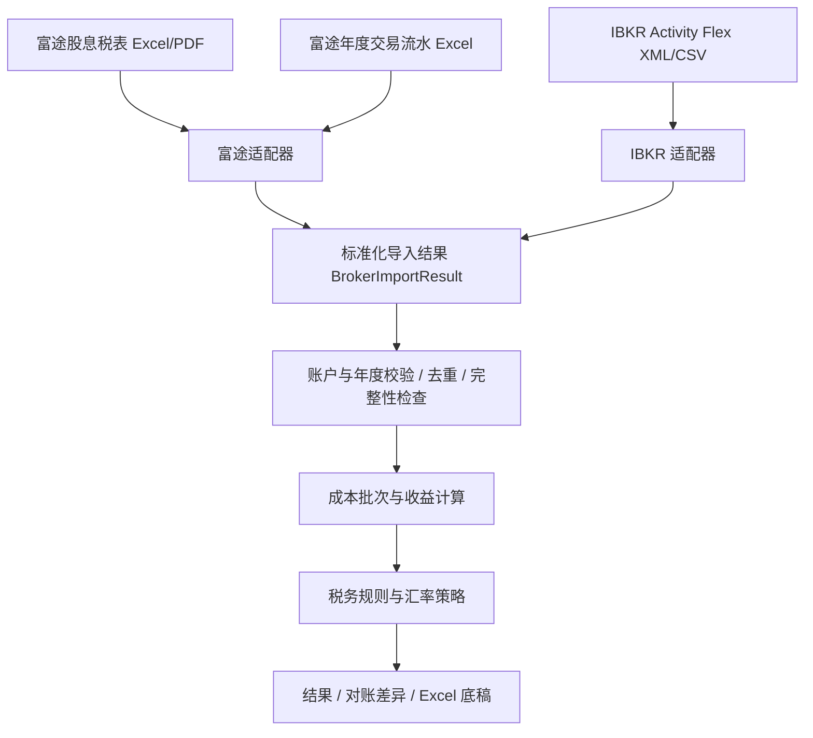

> 历史实施记录：保留各阶段日期、验证数字和当时技术，不作为当前代码状态。2026-10-10 已删除 WinForms 与 Python 项目；当前范围见 [文档索引](README.md)与[文档复审](文档复审_20261010.md)。

# 项目优化建议与 IBKR 接入规划

审查日期：2026-09-22  
文档状态：截至 2026-10-08，已实现 XML 自动获取、原始成交总额分配、结果状态拆分、计算快照和原币现金闭环；最新实施及验收见第 15 节。真实样本已做部分验收，仍有未支持事件及税务规则边界。

> 第 2—7 节的“现状”“已验证”描述保留首次审查证据；当前实施状态以第 10、11 节为准。

> 第 10—14 节也保留当时的实施记录；当前状态以第 15 节为准，不应将历史“未完成项”直接当作当前待办。

## 1. 结论与术语澄清

项目已经具有页面、应用服务、解析器、领域计算和导出器的分层，可以在现有结构上扩展。接入 IBKR 前，优先修复成本匹配、年度隔离、预扣税冲正等影响结果准确性的问题，再扩展券商适配能力。

此前建议中的“券商报告数据包”指的是**程序内部的统一数据结构**，不是富途提供的下载产品、压缩包或某一种文件格式。用户不需要寻找或下载“富途数据包”。为避免歧义，后续统一称为 **“标准化导入结果（BrokerImportResult）”**。

用户输入与程序内部结构应明确区分：

| 层次 | 富途 | IBKR（规划） |
| --- | --- | --- |
| 用户准备的文件 | 现有股息税表（Excel/PDF）和年度交易流水（Excel） | 优先使用 Activity Flex XML；CSV 后续支持，实际字段以导出模板为准 |
| 页面操作 | 选择富途并分别上传现有文件，无需转换或打包 | 选择 IBKR 并上传对应报告文件 |
| 解析适配器 | 读取两类富途文件，整理账户、交易、收入、扣税、持仓等信息 | 读取 IBKR 报告中的相应部分 |
| 内部输出 | 标准化导入结果 | 标准化导入结果 |
| 后续处理 | 统一校验、成本计算、税额测算、对账和导出 | 复用同一处理流程 |

因此，原建议“把导入入口从两份富途文件改成券商报告数据包”应修正为：

> 保留富途现有文件上传方式，在应用服务与各券商解析器之间增加适配层；不同券商的原始文件解析后，统一转换为标准化导入结果，再交给计算服务。

文件必填规则应结合计算范围确定。当前页面要求两份文件都上传；未来若支持“仅收入测算”或“仅交易测算”，应明确标注结果覆盖范围。只有能够确认收入为零时，才能视为零收入；缺少收入文件不能自动等同于没有收入。

## 2. 本次审查范围与验证证据

已检查页面、应用服务、解析器、FIFO 引擎、税额计算、Excel 导出、领域模型和测试，并核对 IBKR 官方报告文档。

| 验证项目 | 结果 | 证据边界 |
| --- | --- | --- |
| 现有自动化测试 | 30 个测试全部通过 | 不能证明未覆盖的边界场景正确 |
| 本地年度样例 | 2021—2025 年样例均可完成计算并生成 Excel，包括 2025 年 PDF 股息表 | 证明流程可运行，不代表已逐笔核对全部金额与成本来源 |
| 合成边界案例 | 已复现跨账户及币种匹配、年度混入、后续卖出被跳过、同日顺序改变、扣税冲正、多币种合计问题 | 使用合成数据，不代表每份现有样例均触发这些问题 |
| Streamlit 应用测试 | 预存结果在无上传文件时仍显示，结果警告未持续显示 | 使用 AppTest，未做浏览器人工验收 |
| IBKR 接入 | 已核对官方字段和报告层级 | 尚未使用真实 IBKR 报告完成解析、对账或验收 |

首次审查和最初文档整理未修改业务代码；用户同意执行后进行了第 10 节所述整改。执行前已有的页面双文件必填及分红类型识别改动已保留。

## 3. 优先修复的准确性问题

### 3.1 P1：FIFO 库存缺少账户与证券身份隔离

- 位置：`domain/services/engine.py`，库存初始化及买卖匹配；`domain/models/trade_record.py`。
- 现状：库存仅以 `symbol` 为键，没有使用账户、市场、币种等信息隔离。
- 已验证：不同账户、不同市场及币种的同代码买卖仍被匹配，买入金额被用于卖出币种的收益计算。
- 建议：成本库存至少按券商、账户、稳定的证券标识和币种隔离。交易市场作为证券识别和校验信息，不应只凭展示代码判断为同一证券。
- 验收：不同账户或不同证券的交易不能串用成本；跨账户转仓必须通过明确的转仓事件及成本结转处理。

### 3.2 P1：目标年度未贯穿计算流程

- 位置：`application/tax_service.py`、`domain/services/tax_engine.py`、`domain/services/engine.py`。
- 现状：指定 `tax_year` 后仍汇总所有传入股息记录；FIFO 使用首笔交易年份进行收益换算。
- 已验证：2023 年股息 100、2024 年股息 200，指定 2024 年后输出 300；2021 年买入、2022 年卖出的测试仍请求 2021 年汇率。
- 建议：分别定义报告覆盖期间、目标年度、历史成本数据范围和各类事件的归属日期。历史买入用于构建成本，目标年度卖出用于汇总本年度收益。
- 注意：不能简单删除所有非目标年度交易，否则会丢失历史成本。采用历史交易重建库存或期初成本批次时，应避免重复计入同一批持仓。
- 验收：股息、利息、扣税、资本收益和辅助流水均按明确范围处理；汇率选取遵循统一且可追溯的策略。

### 3.3 P1：缺失成本导致后续卖出全部被跳过

- 位置：`domain/services/engine.py` 中 `skipped_symbols` 逻辑。
- 现状：某证券首次无库存卖出后，该证券后续卖出均跳过，即使后来已导入新的买入。
- 已验证：1 月无库存卖出、2 月买入、3 月卖出的案例，最终匹配记录为 0。
- 建议：生成明确的缺失成本问题记录，保存受影响的交易、数量和来源，并将结果标记为不完整。库存状态无法可靠恢复时阻止确认完整结果；不能仅删除跳过逻辑后默认继续算对。
- 验收：所有未计算卖出可追踪；页面与导出文件均展示完整性状态，不将部分结果标记为完整年度结果。

### 3.4 P1：成交时间丢失，同日交易顺序被改变

- 位置：`infrastructure/parsers/trade_parser.py` 中 `_parse_date`；`domain/services/engine.py` 中交易排序。
- 现状：成交时间被截为日期，同日所有买入排在卖出前。
- 已验证：输入同日先卖后买的记录，仍形成成本匹配。
- 建议：交易保留完整时间、适用时区、成交标识和稳定序号。原文件缺少时间时明确记录排序依据与局限，不能人为假设买入一定先发生。
- 验收：实际交易顺序得到保留；做空等未支持场景明确报告，不能当作普通多头交易处理。

### 3.5 P1：预扣税退回与冲正方向丢失

- 位置：`infrastructure/parsers/trade_parser.py` 中 `_parse_withholding_tax`。
- 现状：预扣税金额统一取绝对值。
- 已验证：扣税 10、退回 4，净扣税应为 6，当前得到 14。
- 建议：保留原始金额符号，区分扣税、退回与冲正，尽量关联原始收入或扣税事件。不要在解析阶段仅保留按币种合计。
- 验收：扣税和退回方向正确；重复记录、更正记录和年度边界得到校验。

### 3.6 接入前必须核实：期初持仓价格是否为历史成本

- 位置：`domain/models/position_record.py`、`infrastructure/parsers/trade_parser.py`、`domain/services/engine.py`。
- 现状：直接将持仓表的 `价格` 当作买入单价，买入费用设为零；模型没有区分市价、平均成本和原始成本批次。
- 证据边界：尚未确认富途样例中的该列一定存在语义错误，不能将此项写成已证实的样例金额错误。
- 建议：独立定义期初成本批次，保存原始买入时间、剩余数量、成本金额、费用是否已计入和来源。缺少可靠成本时要求补充资料或标记待复核。
- IBKR 映射要求：区分 Mark Price、Cost Basis Price、Cost Basis Money；使用 FIFO 时优先取得可靠的历史成交或批次信息，不能把持仓汇总平均成本当成完整批次序列。
- 验收：成本来源可解释；本期交易与期初批次不重复；期末数量与报告持仓可对账。

## 4. 结果展示与导出改进

### 4.1 P2：禁止不同币种原币金额直接合计

- 位置：`infrastructure/exporters/excel_exporter.py`，入金及分红汇总；`app.py`，按证券展示的金额汇总。
- 已验证：100 USD 与 100 HKD 入金出现“合计 200”。
- 建议：原币按币种分别汇总；统一总额须明确换算币种和汇率策略。按证券汇总时保留账户、证券身份、币种等必要维度。
- 中间计算和汇总保持 `Decimal`；输出时按统一精度转换。

### 4.2 P2：结果与输入文件绑定，警告持续显示

- 位置：`app.py` 的计算按钮、`session_state`、结果展示及下载区域。
- 已验证：AppTest 中没有上传文件时，预存结果和下载入口仍可显示；结果中的自定义警告未持续展示。
- 建议：结果保存输入指纹、券商、账户、年度和计算参数。文件或参数变化时标记旧结果失效；计算失败时不得让旧结果看起来像本次结果。
- 警告、未支持记录和完整性状态应跟随结果渲染，并写入导出文件。

### 4.3 报告应提供可追溯底稿

建议导出内容包含：

- 输入文件清单、报告期间、券商和账户范围。
- 成交及收入来源标识、成本匹配关系、扣税与冲正明细。
- 目标年度、成本法、汇率值及来源、规则版本。
- 已计算记录、待补成本记录、不支持记录和对账差异。
- 结果完整性说明，避免将“部分可计算”误解为“完整年度已核对”。

## 5. 券商适配与统一计算结构

### 5.1 应用服务依赖统一结果

当前 `TaxCalculationService` 直接创建富途解析器，并要求先得到股息数据。建议将券商文件解析与通用计算编排分开，通过适配器接口或构造参数传入实现。

`BrokerImportResult` 是拟议名称，不代表当前已存在此类。建议包含以下内容：

| 数据 | 用途 |
| --- | --- |
| 券商、账户、报告期间 | 确定数据范围和归属 |
| 文件来源、内容指纹、解析器版本 | 追踪与重复导入检查 |
| 交易记录 | 成本与收益计算 |
| 股息、利息等收入 | 保留收入类型、金额及适用日期 |
| 扣税与冲正事件 | 计算净扣税并保留关联信息 |
| 期初成本批次、持仓快照 | 成本初始化和期末核对 |
| 公司行动与转仓 | 处理数量变化、身份变化与成本结转 |
| 解析问题与覆盖范围 | 区分缺失、不支持、警告和错误 |

富途已有的年度收入汇总可以保留为年度级记录，不应伪造不存在的逐笔收入或支付日期。IBKR 明细输入和富途年度汇总都应保留各自的数据粒度。

### 5.2 补齐交易身份与去重能力

建议扩展交易及匹配模型，保存券商、账户、稳定证券标识、交易 ID、完整成交时间、资产类型、费用币种、来源文件和原始记录位置。

IBKR 的 Conid 可作为券商内证券标识；跨券商身份映射需要明确规则。展示代码不能直接作为跨券商证券身份。

多份月报、年报或重复上传不能重复计入。优先使用券商成交标识，结合账户及记录类型处理去重和更正。不能只按日期、代码、数量和价格删除“重复”记录，因为真实成交可能具有相同字段。

### 5.3 计算策略与导入逻辑分离

目前税率、损益汇总、抵免及年度平均汇率策略直接写在计算逻辑中。建议显式定义策略和适用范围，报告中记录版本。境外扣税保留收入类别及来源国家／地区等必要信息；来源不明时标记待确认，不能由币种推断。

“程序按某套规则计算正确”和“这套规则适用于实际申报”是不同验收项。本文不新增或确认任何税务申报口径；后续需确认口径后再固化为策略和测试。

### 5.4 对账作为独立输出

至少检查持仓数量、成交金额、费用、收入和扣税。IBKR 提供的收益数据可用于比较，但不能直接覆盖系统结果。差异应能解释为数据范围、成本批次、成本法、费用、汇率或舍入等原因。

## 6. IBKR 首版接入范围

### 6.1 输入格式与报告部分

优先实现本地 Activity Flex XML 导入，CSV 后续支持。该顺序是针对当前离线应用结构的工程建议；最终解析契约需以实际报告样例和导出模板确认。

重点核对报告中的账户信息、Trades、Cash Transactions、Open Positions、证券信息、Corporate Actions 和 Transfers 等部分是否可用，以及其覆盖期间和明细层级。

Trades 可包含成交、订单、平仓批次等不同层级。应明确以成交明细作为交易输入，其他层级用于核对或成本资料补充，避免重复计入。期初成本资料必须对应正确时点，不能将年末持仓直接当作本年期初持仓。

### 6.2 支持范围

- 优先覆盖普通股票、ETF 多头交易，以及股息、利息和预扣税。
- 识别期权、期货、做空、拆股、合并、转仓等事件；未支持时列出受影响记录和结果范围。
- 转仓不能凭新增持仓自动生成买入成本；影响成本的公司行动也不能静默忽略。
- 区分实际入账现金事件与应计项目，防止收入重复计入。
- 保留原币、费用币种和券商基准币种的含义，不将券商基准币种自动视为人民币。

### 6.3 自动下载维护项

Flex Web Service 已接入。其流程为先请求生成报告，再凭返回的引用码获取报告，代码已处理生成等待、失败重试、令牌配置和敏感信息隐藏。

自动下载作为文件获取方式，复用同一解析和校验流程。后续只需继续完善令牌失效提示、网络错误分类和下载结果审计，不应再把应用描述为“不联网”。

## 7. 工程维护与性能

1. **统一读取文件。** 当前同一交易工作簿打开五次，资金表重复解析。建议一次打开、统一读取，显式管理文件资源，再返回标准化结果。
2. **完善输入校验。** 对必填列、空值、非有限数值、数量、币种、日期和报告范围进行校验。不能把所有缺失金额都当作零；不支持记录应进入问题清单。
3. **增加有意义的回归测试。** 当前集成测试主要验证流程和导出非空；补充金额断言、完整性状态及对账断言。
4. **建立脱敏测试夹具。** 现有解析和集成测试依赖本地被忽略的 `samples` 文件。建立可提交的合成或充分脱敏样例，使新环境可复现测试。
5. **管理依赖。** 增加开发／测试依赖定义和可复现版本记录，当前 `requirements.txt` 仅限定最低版本，未列出 pytest。
6. **清理版本库缓存。** 当前有 34 个被跟踪的 `.pyc` 文件；后续从版本控制中移除并补充忽略规则，同时保留用户源文件和样例。
7. **同步文档。** README 仍标注应用服务“待实现”、导出两个文件，与实际单份多工作表报告不一致；统一模块名称、运行方式、支持范围和验收状态。

## 8. 实施顺序与验收标准

| 阶段 | 工作内容 | 完成标准 |
| --- | --- | --- |
| 第一阶段：准确性整改 | 账户与证券隔离、年度边界、真实交易顺序、缺失成本、扣税冲正、币种汇总、页面结果状态 | 已复现的问题均有回归测试；部分结果显式标记；现有富途样例仍可运行 |
| 第二阶段：统一导入结构 | 保留富途现有上传文件，增加券商适配接口与标准化导入结果，完善来源和去重信息 | 富途适配后输出可追溯；计算服务不依赖富途字段及文件形态；解析结果差异有明确解释 |
| 第三阶段：IBKR 本地导入 | 确认实际导出模板，建立 XML 字段映射，补充成本资料和对账 | 用脱敏真实报告验证账户、年度、交易、收入、扣税、持仓；差异明确可解释；未支持场景可见 |
| 第四阶段：报告与维护 | 完整底稿、脱敏测试夹具、依赖及文档治理 | 报告可复核；新环境可运行测试；实际支持范围与文档一致 |
| 第五阶段：自动下载维护 | Flex Web Service 获取报告、重试与令牌管理 | 已实现基础流程；继续补充令牌失效提示、审计记录和网络错误分类 |

真实 IBKR 报告尚未验证，第三阶段不能因新增解析器或单元测试通过就宣称完成。

## 9. IBKR 官方参考

以下资料于 2026-09-22 审查时核对，后续实施应结合实际导出模板再次确认：

- [Activity Flex Query Reference](https://www.ibkrguides.com/reportingreference/reportguide/activity%20flex%20query%20reference.htm)：报告部分目录。
- [Trades — Flex Statement](https://www.ibkrguides.com/reportingreference/reportguide/tradesfq.htm)：账户、Conid、交易标识、时间、佣金、成本与明细层级。
- [Open Positions — Flex Statement](https://www.ibkrguides.com/reportingreference/reportguide/open%20positionsfq.htm)：市场价格、成本价格、成本金额以及汇总／批次层级。
- [Cash Transactions — Flex Statement](https://www.ibkrguides.com/reportingreference/reportguide/cash%20transactionsfq.htm)：现金事件类型、金额、币种与日期信息。
- [Retrieve generated report](https://www.interactivebrokers.com/docs/web-api/api-reference/get-statement)：通过引用码取得已请求生成的 Flex 报告。

## 10. 实施记录（2026-09-22）

### 10.1 已实施

- FIFO 按券商、账户号码、证券身份／市场代码及币种隔离；缺少账户或证券身份的记录进入待复核清单。
- 成交保留时间并按时间排序；只有日期的记录在同账户证券当日按来源行序处理并提示。带时区时间按同一时刻排序，混用有／无时区的同账户证券记录拒绝计算。
- 指定年度贯穿收入、扣税、卖出、入金及分红筛选。历史交易可消耗库存，但仅目标年度卖出计入结果并查询对应年度汇率。收入年度不明确时需文件名或显式输入；交易报告明确年度不匹配时拒绝计算。
- 缺失成本和库存不足逐笔生成问题记录。受影响的库存不会因后续买入自动恢复为可信；后续卖出仍逐笔列出，同时允许其他独立账户／证券计算。
- 期初持仓的市场价格不再自动当成本。程序模型可接收明确的 `cost_basis_price`，但富途适配器不会将普通 `价格` 字段填入该字段；历史成本补录及跨年批次结转界面尚未实现。
- 期初持仓重复或与历史交易重叠时明确报告。转仓及公司行动不再仅按日期自动配对更名，未核对事件阻止使用受影响证券成本。
- 预扣税保留现金方向并按年度净额汇总，退回抵减扣税；净退税产生复核项，抵免不产生负数。
- 页面与导出共用按账户／证券／币种分组的汇总，计算使用 Decimal，不再合计不同币种原币金额。
- 结果绑定上传文件内容、文件名和年度；更换输入、移除文件或计算失败时清除旧结果及下载入口。警告随结果持续显示。
- 不完整结果明确标注，导出文件使用 `Partial_Review_<年度>.xlsx`；工作簿提供计算说明、待复核记录、收入明细和交易来源行。
- 增加 `BrokerImportResult`、`WithholdingRecord`、`FutuReportAdapter`；富途仍使用原来的两类文件，交易工作簿一次打开并读取各表。通用计算入口为 `calculate_imported`。
- 增加有限数值、收入必填列、扣税金额、重复工作表等校验；增加合成回归测试、页面状态测试及 `requirements-dev.txt`。

### 10.2 验证状态

最终验证：

- `python -B -m pytest -q -p no:cacheprovider`：**63 passed**（原有 30 项及新增 33 项），21.91 秒。
- 新增测试使用合成 Excel／领域数据，覆盖身份隔离、历史库存与目标年度、期初成本、扣税冲正、时区、异常输入、多币种汇总、准确金额及 AppTest 页面状态。
- 完整合成案例：资本收益 500 CNY，净预扣税 6 CNY，沿用现有规则后的合计补税 114 CNY；核对了领域结果和导出工作簿中的金额。
- Streamlit 实际进程启动后健康接口返回 HTTP 200 / ok；验证进程已关闭。
- `git diff --check` 通过。
- 最终代码逐年试跑并读取导出工作簿，确认收入明细、待复核记录及不完整状态存在：

| 样例年度 | 已计算匹配记录 | 待复核项 | 导出状态 |
| --- | ---: | ---: | --- |
| 2021 | 72 | 64 | 待复核底稿，6 个工作表 |
| 2022 | 5 | 40 | 待复核底稿，6 个工作表 |
| 2023 | 17 | 64 | 待复核底稿，6 个工作表 |
| 2024 | 16 | 83 | 待复核底稿，8 个工作表 |
| 2025 | 175 | 80 | 待复核底稿，10 个工作表 |

待复核项同时包含缺失期初成本、受影响卖出及未支持事件，不能将其数量直接等同于失败交易数量。匹配记录为成本批次匹配数，也不等同于成交笔数。

本地 2021—2025 年样例均可计算并生成待复核底稿；所有年度均存在未确认期初成本或未覆盖事件，不标记为完整结果。相比旧实现，匹配笔数及金额可能变化，这是停止使用未经确认成本和停止隐式跳过记录后的行为变化，不能将旧金额作为正确性基准。

### 10.3 第一阶段结束时的未完成项（后续变化见第 11 节）

- 未实现 IBKR XML／CSV 解析器、Flex Web Service 下载或真实 IBKR 对账。
- 第二阶段仅建立统一导入基础，尚未完成多文件去重、成交更正、来源文件指纹底稿、全部券商接口契约及收入覆盖声明。
- 尚未提供历史成本补录、批次持久化结转、转仓／公司行动处理及期末持仓自动对账。
- 未重新确认税务申报口径；沿用现有 V1 测算策略，尚未实现可配置的规则版本及完整汇率来源底稿。
- 现有样例测试仍依赖被忽略的本地样例文件；新增边界测试不依赖个人样例。依赖锁定和已跟踪 `.pyc` 清理待后续处理。
- AppTest 验证应用交互逻辑，实际主机健康检查验证进程启动；不等同于浏览器人工验收、真实 IBKR 验收或税务结果确认。

## 11. IBKR 本地导入实施记录（2026-09-22）

### 11.1 已实现

- 新增 IBKR Activity Flex XML 适配器和页面券商选择，富途原有两类文件入口保留。
- 支持最多 36 份年度／月份活动报告及多账户；检查各账户年度区间覆盖。
- 按账户＋tradeID／transactionID 去重；同 ID 内容冲突停止计算。仅 EXECUTION 进入成本计算，避免订单及平仓批次重复计数。
- 处理股息、收到的利息、预扣税与退回、出入金；未知现金类型保留明细并提示复核。
- 增加独立期初 LOT 批次输入，按原始买入时间和 costBasisMoney 初始化；不使用年末市值或平均成本。期初批次总成本按剩余金额分摊，最终一笔保留余差。
- 增加期末持仓数量核对、期末快照冲突检查；期初数据不明或期间缺失时不会标记为完整。
- 导出来源文件指纹、报告期间、现金事件与买卖记录 ID。
- 增加合成 XML 夹具与 IBKR 解析、计算、导出、页面回归测试；未导入真实账户资料。

### 11.2 使用文档与验证

导出模板及使用说明见 [IBKR_IMPORT_GUIDE.md](IBKR_IMPORT_GUIDE.md)。

- 全量自动化回归：105 项通过，其中 42 项 IBKR 测试；覆盖解析、FIFO 金额、现金分类、来源导出、异常输入和页面状态切换。
- 合成样例以固定汇率 1 验证股票收益 496、股息 100、利息 20、净扣税 6；按现有 V1 规则测算合计补税 117.20。
- Streamlit 实际进程启动，健康接口返回 HTTP 200 / ok；验证进程已关闭。
- AppTest 验证页面执行和结果失效逻辑，不等同于浏览器人工验收。
- 真实 IBKR 报告未参与本轮测试；模板兼容性、实际账户成本和券商金额对账仍待验收。

### 11.3 仍待完成

真实 IBKR 模板验收、完整现金及券商收益对账、CSV、自动下载、交易更正自动应用、公司行动／转仓／衍生品、异币佣金及交易税处理均未完成。国家／地区税务策略仍沿用原有边界，不因解析器上线而视为已核准。第 10.3 节中“未实现 XML 解析、来源指纹、去重与期末数量核对”的历史状态由本节更新；其他未完成项仍保留。

## 12. IBKR 逐笔已实现盈亏对账（2026-09-22）

### 12.1 已实现

- 读取 Trades / EXECUTION 的 `fifoPnlRealized`，独立保留券商参考金额；本系统 FIFO 和 V1 税额测算仍使用自身计算值。
- 按账户、Conid、币种及卖出成交 ID 对账，多批次成本合并后逐笔比较；仅处理目标年度，容差为 0.02 原币单位。
- 状态区分一致、存在差异、缺少券商收益和无法核对；缺失与未计算金额保持空值，不伪造零值。
- 超过容差生成待复核项，页面和 Excel 展示来源记录；相反差额不互相抵消。
- 重复交易的券商收益字段参与一致性检查，冲突报告停止导入。
- 新增合成对账样例与自动化测试，说明文档增加 Flex 字段设置和核对边界。

### 12.2 验证

- 全量回归 128 项通过，其中本轮新增 23 项盈亏核对测试。
- 验证了正负差额、0.02 容差边界、缺失与零值、多批次、多账户／币种隔离、重复冲突、未支持卖出和匹配数量不足。
- 页面 AppTest 验证差异表、待复核状态，以及换文件后旧对账结果失效；导出测试读取实际 Excel 核对金额、空值和来源。
- 合成样例通过，尚无真实 IBKR 报告验收证据。
- 针对手机 CSV／PDF 的使用反馈，页面与导入说明已明确区分税务文件、普通活动报表和网页 Flex 查询；CSV 适配需先确认具体报告结构，当前没有宣称已支持。

### 12.3 边界

本节补充第 11 节的已实现能力，不表示完整券商盈亏对账完成。仍需脱敏真实 XML 验收、现金余额核对及未支持资产处理。CSV、PDF、自动下载、成本调整及税务策略等既有未完成项继续保留。

## 13. 根据手机税务文件入口调整后续接入顺序

用户已确认手机“下载税表 → 税务文件 → 2025 税表”列出 1042-S、外汇收入工作表及股息报告。下一步优先适配实际股息报告 CSV，随后建立 1042-S 核对；外汇损益单独建模。普通活动报表的交易及历史成本仍须补齐。当前没有真实 IBKR 文件，待取得样例后确认格式并实现，不以增加上传扩展名作为解析完成。

页面已明确提示以上三类文件尚不支持，详细用途与数据去重、基础币种边界见 [IBKR 导入说明第 0.1 节](IBKR_IMPORT_GUIDE.md#01-已确认的手机税务文件入口)。现有 XML 及逐笔盈亏核对继续保留。

## 14. 真实样本验收后的修复记录（2026-09-30）

第 12、13 节记录的是当时的状态；现已收到三份真实 Activity Flex XML。脱敏后的结构、期间和金额核对结论见 [IBKR 导入说明第 7 节](IBKR_IMPORT_GUIDE.md#7-真实导出文件的部分验收2026-09-30)，原始样本保留在本地被 Git 忽略的目录。

- FIFO 成本和买入费用使用跨卖出累计舍入，避免一笔买入分多次卖出时分角丢失；单笔卖出跨小额批次仍按成交总额分配。
- CashReport / Currency 的股息、券商利息和预扣税现与现金明细自动按原币核对；缺失字段、缺失币种或超过 0.02 原币差额均进入待复核。现金余额尚未核对。
- 未支持的 CASH 外汇成交单列，不计入股票／ETF 已实现盈亏一致率；历史年度问题按日期隔离，可能影响成本的转仓与公司行动继续保留。
- XML 无法证明导出模板未筛选记录，因此增加导出范围确认；未确认时只生成待复核底稿。底稿记录该确认、实际汇率来源和 `V1-2026-09` 规则版本，并明确境外扣税抵免关系尚未逐项核对。
- 当前本地全量自动化测试为 146 项通过。真实样本仍不足以确认完整年度：缺少 2026 年末报告、经确认的期初成本批次和 2026 年兑人民币汇率；不可据此出具完整年度税额。

## 15. 反方架构审查后的整改（2026-10-08）

### 15.1 本轮完成

1. **成交总额守恒。** FIFO 买入成本和卖出收入优先使用经解析器校验的券商原始成交金额，按数量分配至批次并累计舍入。缺失原始成交金额用 `None` 表示，才按数量乘价格重建；价格重算继续作为解析阶段的校验依据。成交差异超过既有容差仍保留待复核或阻断成本处理。
2. **结果状态拆分。** 页面与计算说明分别展示计算状态、数据完整性、对账状态和临时用途。`data_complete` 表示未发现数据阻断项；`is_complete` 还要求持仓、卖出盈亏和现金核对通过，且不属于临时测算。缺少券商盈亏或现金余额资料可继续测算，但不再声称全部核对完成。富途尚未实现同等现金闭环，因此保留“待对账”状态。
3. **计算快照。** 结果记录来源文件摘要、实际使用汇率及来源、计算年度、规则版本、业务代码和汇率配置摘要、用户范围确认、UTC 计算时间及计算编号，导出新增“计算快照”。页面结果指纹加入业务代码和汇率配置摘要，配置变化后的下一次页面重跑会清除旧结果及下载入口。令牌和联网配置不进入快照。快照不自动备份原始报表或源码，复现时仍需保留对应文件和代码版本。
4. **现金闭环。** 每份活动报告按账户、原币及报告期间独立核对“期初现金＋成交和现金明细净变动＝期末现金”。股票同币佣金使用原始净现金，普通现货换汇记录基础币种数量和报价币种现金两条腿，佣金按实际扣费币种计入。月报和年报重叠时分别核对，不相加。基础币种折算、已结算余额和成交日余额不混用；缺字段、期间错误或未支持的现金影响事件显示“无法核对”，差额超过 0.02 原币单位生成待复核项。

现金余额口径依据：[IBKR Cash Report Flex Statement](https://www.ibkrguides.com/reportingreference/reportguide/cash%20reportfq.htm)。现金闭环一致不表示外汇、费用或其他事件的税务处理已确认；这些原有待复核项继续保留。

### 15.2 验证证据

- 全量回归：**176 项通过**，包含 7 项 Streamlit 页面测试；本轮新增 15 项金额、现金、状态和配置边界测试。
- 合成案例验证券商卖出总额 `1500.02` 全部分配，买入总额 `1000.01` 保留到收益与现金核对；一笔原始成本跨多次卖出保持守恒。
- 覆盖缺少 CashReport、缺少卖出盈亏、现金差异、不同结算余额、换汇双币种及异币佣金、其他费用、重复报告、错误期间、当前／未来年度、计算快照和配置失效。
- 本地 2025 全年真实报告可完成计算与导出：两种原币现金闭环一致，10 笔股票卖出盈亏一致。103 条 CASH 外汇成交和 4 条其他费用仍按原有规则列为未支持／待复核，不据此出具已核准的完整税额。
- 2026 汇率已补充为截至 2026-10-08 的报价日平均值，仅供临时测算，来源和统计方法见 [EXCHANGE_RATE_SOURCES.md](EXCHANGE_RATE_SOURCES.md)。2026 全年尚未结束，仍需年末报告与全年汇率。

### 15.3 后续待办

- 期末 LOT 剩余数量、成本、费用及舍入状态的持久化结转，并验证连续计算与分年计算一致。
- 汇率来源元数据的严格结构校验、缺失来源提示和历史年度来源核验。
- 将普通换汇确认、其他费用分类及补成本操作形成按账户／年度／输入指纹绑定的复核流程。
- 脱敏真实模板的可提交夹具、依赖锁定及版本库缓存清理。
- 交易更正、转仓、公司行动、衍生品及税务规则边界继续保留；Excel／PDF 接入按用户约定放在 XML 稳定之后。
